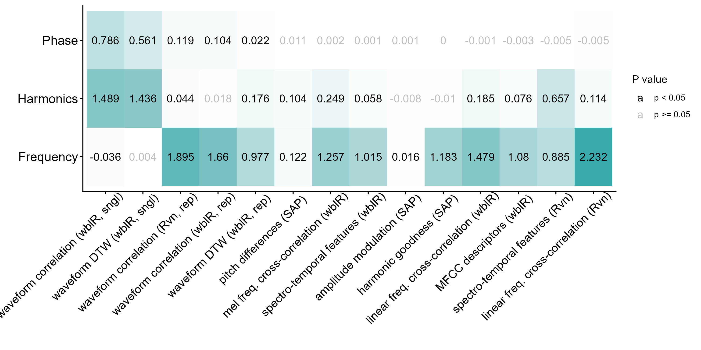

This site contains the analyses behind the manuscript (under review). We compared nine acoustic structure quantification methods, as implemented in [warbleR](https://marce10.github.io/warbleR/), Raven Pro and Sound Analysis Pro, for their ability to detect differences in synthesized Schroeder-phase signals, which differ only in acoustic fine structure (AFS) phase. We then evaluated the two waveform-based methods (waveform correlation and waveform dynamic time warping, available in `warbleR::waveform_similarity()`) under decreasing signal-to-noise ratios.

## Analysis reports

- **[Method comparison](scripts/1_schroeder_synthesis_and_method_comparison.qmd)**: synthesis of Schroeder signals, acoustic measurements with each method, and multiple regression on distance matrices (Table 1, Figs. 1–6)
- **[Background noise](scripts/2_background_noise_effect.qmd)**: addition of white noise, waveform similarity and effect sizes across signal-to-noise ratios (Fig. 7)

## Main results

::: {.figure-gallery}

:::

## Reproducibility

All code and data are available in the [GitHub repository](https://github.com/maRce10/acoustic-fine-features-zebra-finch). See the repository README for the folder structure and for details on files too large to be hosted on GitHub.
