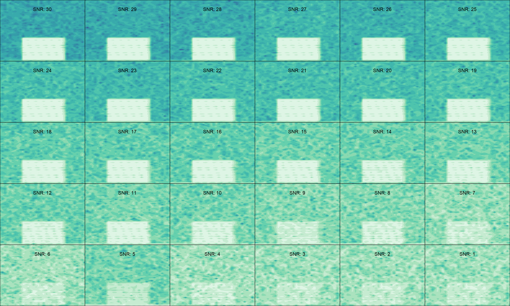
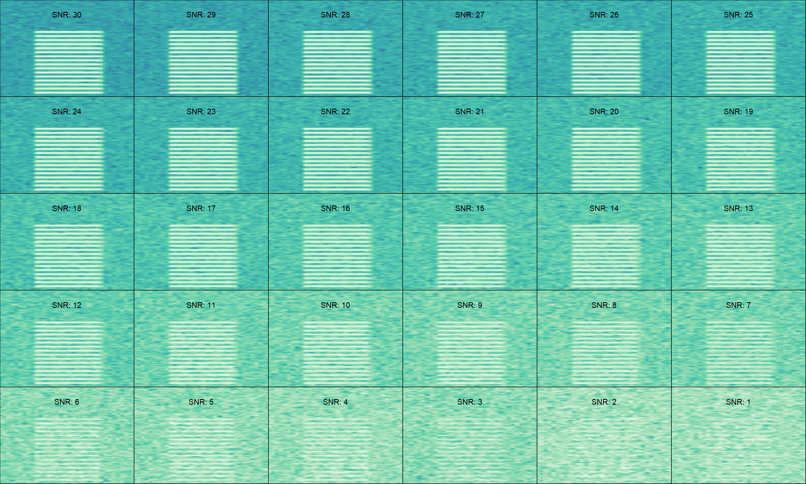
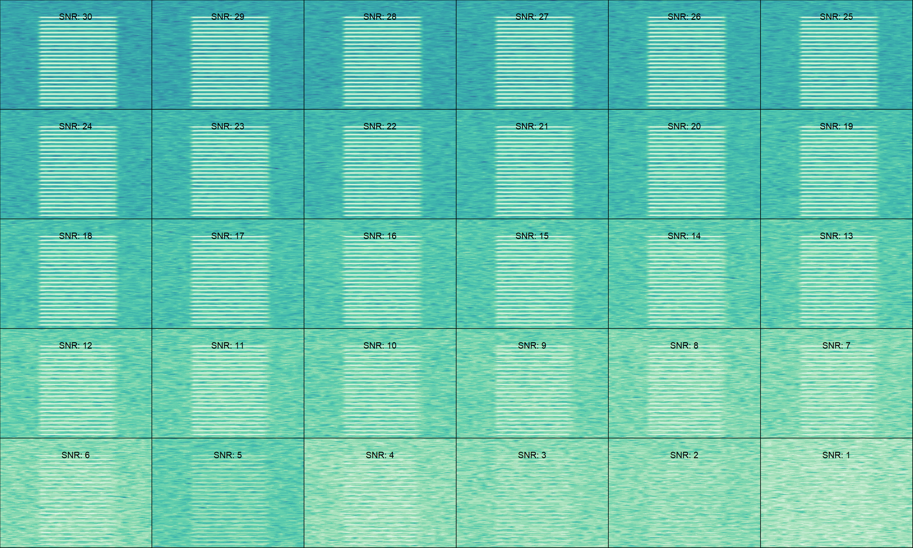
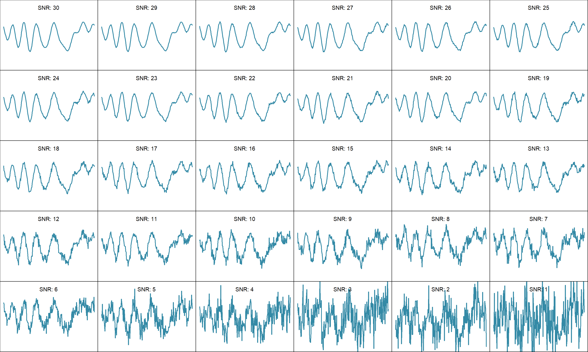
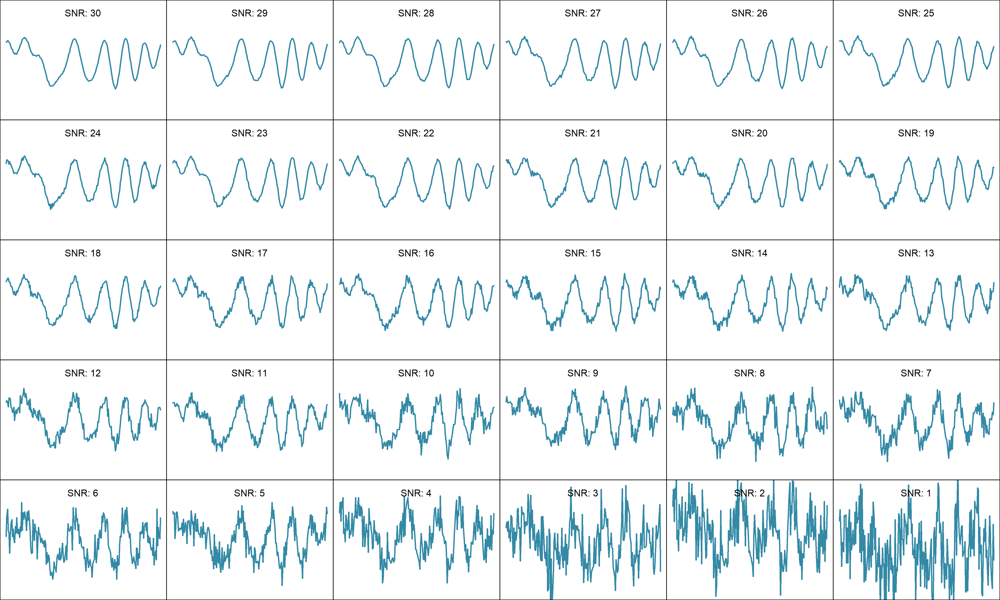
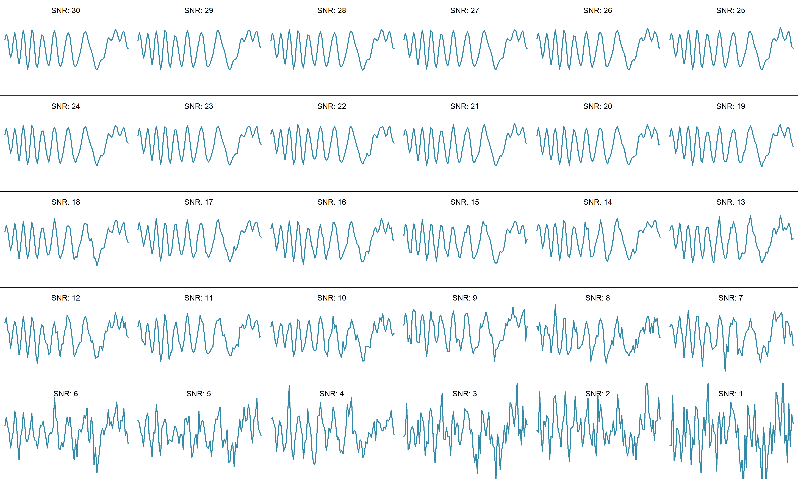
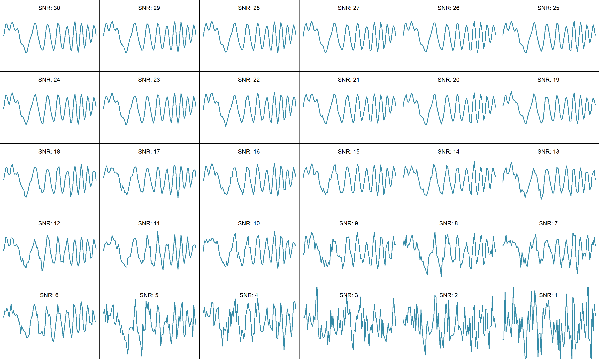
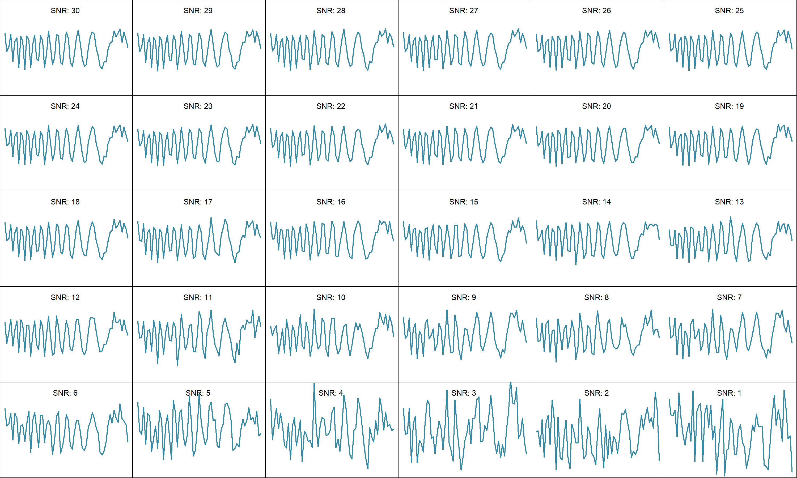
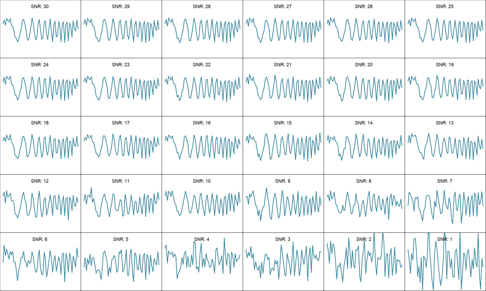
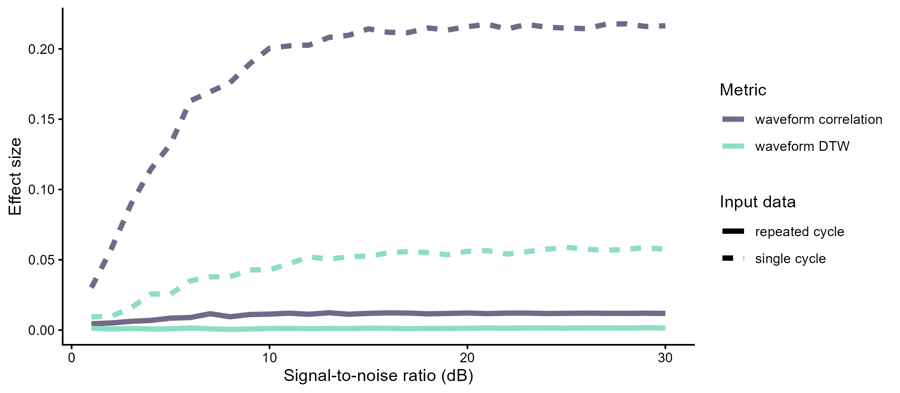

```{r add link to github repo, echo = FALSE, results='asis'}

# print link to github repo if any
if (file.exists("../.git/config")) {
  config <- readLines("../.git/config")
  url <- grep("url", config, value = TRUE)
  url <- gsub("\\turl = |.git$", "", url)
  cat("\nSource code and data found at [", url, "](", url, ")", sep = "")
}
```

```{r load packages and setup style, echo = FALSE, message = FALSE, warning=FALSE}

# github packages must include user name ("user/package")
pkgs <- c("kableExtra", "knitr", "formatR", "seewave", "tuneR", "warbleR", "viridis", "Rraven", github = "maRce10/baRulho", "ggplot2", github = "maRce10/PhenotypeSpace", "ecodist", "numform")

# install/ load packages
sketchy::load_packages(pkgs, quite = TRUE)

# options to customize chunk outputs
knitr::opts_chunk$set(
  class.source = "numberLines lineAnchors", # for code line numbers
  tidy.opts = list(width.cutoff = 65),
  tidy = TRUE,
  message = FALSE,
  dpi = 150, # with fig.retina = 2 (default) plots are saved at 300 dpi
  fig.retina = 2
)

knitr::opts_knit$set(root.dir = "..")

```

&nbsp; 

<!-- skyblue box -->

<div class="alert alert-info">

# Purpose

- Evaluate the effect of degradation on the detection of acoustic fine structural variation in Schroeders

</div>

&nbsp;

```{r}

source("./scripts/MRM2.R")

warbleR_options(parallel = 22)


```

# Data analysis workflow

```{mermaid}

flowchart LR
  A[Raw Schroeder\nrecordings] --> B(Aritfically\nDecrease SNR) 
  B --> C(measure\nSchroeder\nsimilarity)
  C --> D(Matrix\nregression\nmodels)
  
style A fill:#44015466
style B fill:#3E4A894D
style C fill:#6DCD594D
style D fill:#FDE7254D

```


# Degradation as a function of signal-to-noise ratio

- Adding synthetic noise to the master sound file annotations to decrease the signal-to-noise 
- Evaluate at which signal-to-noise ratio Schroeder sign can still be distinguished


## On 200ms schroeders

### Add synthetic noise

The noise-added Schroeders are saved as lists of 30 extended selection tables (one per signal-to-noise ratio). These files are too large for GitHub, but they can be regenerated with the code below from the extended selection tables and master sound file included in the repository (`data/processed/`). Extended selection tables store the sounds inside the R object, so no other sound files are needed. The waveform similarity values and model fits computed from them are included in the repository.

#### Repeated Schroeders
```{r, eval = FALSE}
master_annotations <- imp_raven(path = "./data/processed", files = "200ms_schroeders.txt", warbler.format = TRUE, all.data = TRUE)

master_annotations$sound.id <- paste0("f0:", master_annotations$f0, "_comp:", master_annotations$label)

master_annotations$sound.id[1] <- "start_marker"
master_annotations$sound.id[nrow(master_annotations)] <- "end_marker"

est_master <- selection_table(master_annotations[grep("marker", master_annotations$sound.id, invert = TRUE),], extended = TRUE, mar = 0.1, path = "./data/processed")


# est_schr <- readRDS("./data/processed/extended_selection_table_schroeders.RDS")
# est_schr <- readRDS(file.path(path, "extended_sel_table_degradation_exp.RDS"))
# est_schr$treatment <- ifelse(grepl("inside", est_schr$sound.files), "inside", "outside")
# est_schr$sound.id <- 1:nrow(est_schr)
# 
# est_in <- est_schr[est_schr$treatment == "inside", ]

est_master <- signal_to_noise_ratio(est_master, mar = 0.07, cores = 20)

hist(est_master$signal.to.noise.ratio)

adj_snr_schroeder_white <- lapply(30:1, function(i){
print(i)
    est_schr_adj <- baRulho::add_noise(X = est_master, target.snr = i, precision = 0.1, mar = 0.07, cores = 20, kind = "white", seed = i)
 est_schr_adj$target.snr <- i
 return(est_schr_adj)
})

saveRDS(adj_snr_schroeder_white, "./data/processed/200ms_schroeders_adjusted_snr_white_noise.RDS")
```

#### Single Schroders
```{r}
#| eval: false
 
est_schr <- readRDS("./data/processed/extended_selection_table_single_schroeders.RDS")

est_schr$sound.id <- "a"
est_schr <- signal_to_noise_ratio(X = est_schr, mar = 0.01, cores = 20, bp = NULL)

hist(est_schr$signal.to.noise.ratio)

adj_snr_schroeder_white <- lapply(30:1, function(i){
print(i)
    est_schr_adj <- add_noise(X = est_schr, target.snr = i, precision = 0.1, mar = 0.01, cores = 1, bp = NULL, kind = "white", seed = i)
 est_schr_adj$target.snr <- i
 return(est_schr_adj)
})

saveRDS(adj_snr_schroeder_white, "./data/processed/single_schroeder_adjusted_snr_white_noise.RDS")

```


### Check SNR adjusted waves

Example sounds at each of the 30 signal-to-noise ratios. Plots are saved as image files (this step reads the large noise-added sound files and is not run when rendering).

#### Repeated Schroeders (spectrograms)
```{r snr-examples-repeated}
#| eval: false

adj_snr_schroeder <- readRDS("./data/processed/200ms_schroeders_adjusted_snr_white_noise.RDS")

dir.create("./output/figures/snr_examples", showWarnings = FALSE)

# index in selection table, file name and frequency limit (kHz)
rep_examples <- data.frame(
    index = c(10, 150, 250),
    name = c("repeated_f0-200_ncomp-9_pos", "repeated_f0-500_ncomp-16_pos", "repeated_f0-700_ncomp-24_pos"),
    flim = c(5, 12, 20)
)

for (e in seq_len(nrow(rep_examples))) {
    png(file.path("./output/figures/snr_examples", paste0(rep_examples$name[e], ".png")), width = 4500, height = 2700, res = 300)
    par(mar = c(0, 0, 0, 0), mfrow = c(5, 6))
    for (i in 1:30) {
        warbleR:::spectro_wrblr_int(
            wave = read_sound_file(adj_snr_schroeder[[i]], rep_examples$index[e], from = 0, to = Inf),
            flim = c(0, rep_examples$flim[e]),
            osc = FALSE,
            scale = FALSE,
            axisY = FALSE,
            axisX = FALSE,
            grid = FALSE,
            palette = viridis::mako,
            collevels = seq(-110, 0, 5)
        )
        text(0.2, rep_examples$flim[e] * 0.85, paste("SNR:", adj_snr_schroeder[[i]]$target.snr[1]), col = "black", cex = 1.3)
    }
    dev.off()
}
```

200 Hz, 9 components, positive phase



500 Hz, 16 components, positive phase



700 Hz, 24 components, positive phase



#### Single Schroeders (waveforms)
```{r snr-examples-single}
#| eval: false

adj_snr_schroeder <- readRDS("./data/processed/single_schroeder_adjusted_snr_white_noise.RDS")

sngl_examples <- data.frame(
    index = c(10, 9, 150, 149, 250, 249),
    name = c("single_f0-200_ncomp-9_pos", "single_f0-200_ncomp-9_neg", "single_f0-500_ncomp-16_pos", "single_f0-500_ncomp-16_neg", "single_f0-700_ncomp-24_pos", "single_f0-700_ncomp-24_neg")
)

for (e in seq_len(nrow(sngl_examples))) {
    png(file.path("./output/figures/snr_examples", paste0(sngl_examples$name[e], ".png")), width = 4500, height = 2700, res = 300)
    par(mar = c(0, 0, 0, 0), mfrow = c(5, 6))
    for (i in 1:30) {
        wv <- read_sound_file(adj_snr_schroeder[[i]], sngl_examples$index[e])@left

        plot(wv, type = "l", lwd = 2, col = mako(10)[6], xlab = "", ylab = "", axes = FALSE, ylim = c(-2, 2))
        box()

        text(length(wv) / 2, 1.7, paste("SNR:", adj_snr_schroeder[[i]]$target.snr[1]), col = "black", cex = 1.3)
    }
    dev.off()
}
```

200 Hz, 9 components, positive phase



200 Hz, 9 components, negative phase



500 Hz, 16 components, positive phase



500 Hz, 16 components, negative phase



700 Hz, 24 components, positive phase



700 Hz, 24 components, negative phase




### Measure waveform similarity
 
#### On repeated Schroeders
```{r, eval = FALSE}

adj_snr_schroeder <- readRDS("./data/processed/200ms_schroeders_adjusted_snr_white_noise.RDS")


dist_white_noise <- lapply(adj_snr_schroeder, function(schroeders) {
    
    print(schroeders$target.snr[1])
    dtw_dist <- waveform_similarity(X = schroeders, parallel = 22,
                                    output = "rectangular",
                                    sim.method = "DTW", 
                                    type = "sliding",
                                    wl = 32)
    
    cor_dist <- waveform_similarity(X = schroeders, parallel = 22,
                                    output = "rectangular",
                                    sim.method = "correlation", 
                                    type = "sliding",
                                    wl = 32)
    
    
    dtw_dist$cor <- cor_dist$similarity
    
    names(dtw_dist) <- c("schr1", "schr2", "dtw", "cor")
    
    dtw_dist$target.snr <- schroeders$target.snr[1]
    
    return(dtw_dist)
})


saveRDS(dist_white_noise, "./data/processed/waveform_similarity_adjusted_snr_200ms_schroeders_white_noise.RDS")

```

#### On single Schroeders
```{r, eval = FALSE}
adj_snr_schroeder <- readRDS("./data/processed/single_schroeder_adjusted_snr_white_noise.RDS")

rep_schroeder <- readRDS("./data/processed/200ms_schroeders_adjusted_snr_white_noise.RDS")[[1]]

dist_white_noise <- lapply(adj_snr_schroeder, function(schroeders) {

    schroeders$sound.id <- sapply(schroeders$sound.files, function(x) {
        a <- strsplit(x, "_")[[1]]
        paste(paste0("f0:", gsub("-", " ", a[2])), gsub("ncomp-", "comp:",a[3]), substr(a[4], 0, 1), sep = "_")
    }) 
        
    schroeders$bottom.freq <- sapply(schroeders$sound.id, function(x) rep_schroeder$bottom.freq[rep_schroeder$sound.id == x])

    schroeders$top.freq <- sapply(schroeders$sound.id, function(x) rep_schroeder$top.freq[rep_schroeder$sound.id == x])

        print(schroeders$target.snr[1])
    dtw_dist <- waveform_similarity(X = schroeders, parallel = 22,
                                    output = "rectangular",
                                    sim.method = "DTW", 
                                    type = "sliding",
                                    wl = 32)
    
    cor_dist <- waveform_similarity(X = schroeders, parallel = 22,
                                    output = "rectangular",
                                    sim.method = "correlation", 
                                    type = "sliding", 
                                    wl = 32)
    
    
    dtw_dist$cor <- cor_dist$similarity
    
    names(dtw_dist) <- c("schr1", "schr2", "dtw", "cor")
    
    dtw_dist$target.snr <- schroeders$target.snr[1]
    
    return(dtw_dist)
})

saveRDS(dist_white_noise, "./data/processed/waveform_similarity_adjusted_snr_single_schroeder_white_noise.RDS")

```


#### Statistical analysis

Modeling:
 - [Multiple Regression on distance Matrices](https://search.r-project.org/CRAN/refmans/ecodist/html/MRM.html) 
 - Model:   
 \begin{align*}
 Dissimilarity &\sim frequency + components + phase
 \end{align*}
 - Response values scaled to make effect sizes comparable across models
 - Predictors were coded as pairwise binary matrices in which 0 means that calls in a dyad belong to the same level and 1 means calls belong to different levels 
 - One model for each environment treatment as well as on the original model sounds

##### On repeated Schroeders
###### DTW
Note: the DTW model on repeated Schroeders used the "_v2" waveform similarity file (a second run of the "Measure waveform similarity" step above, saved under a different name), while the correlation model used the first run. Both files are included in the repository so the models can be refit exactly as reported.
```{r, eval = FALSE}

dtw_dists_snr_list <-
    readRDS("./data/processed/waveform_similarity_adjusted_snr_200ms_schroeders_white_noise_v2.RDS")
    
adj_snr_schroeder1 <- readRDS("./data/processed/200ms_schroeders_adjusted_snr_white_noise.RDS")[[1]]

adj_snr_schroeder1$sound.id <- gsub("f0:f0 ", "f0:", adj_snr_schroeder1$sound.id)

    
dtw_wv_mod_list <-
    warbleR:::pblapply_wrblr_int(dtw_dists_snr_list, cl = 20, function(x) {
        
      # scale between 0 and 1
        x$dtw <- (x$dtw - min(x$dtw)) / (max(x$dtw) - min(x$dtw))
        target_snr <- x$target.snr
        x$target.snr <- NULL

        x$schr1 <- sapply(x$schr1, function(x) adj_snr_schroeder1$sound.id[adj_snr_schroeder1$sound.files == gsub("-1$","", x)])
        x$schr2 <- sapply(x$schr2, function(x) adj_snr_schroeder1$sound.id[adj_snr_schroeder1$sound.files ==  gsub("-1$","", x)])
        
        dtw_tri <- PhenotypeSpace::rectangular_to_triangular(x[, c("schr1", "schr2", "dtw")])
        
        freq_bi_tri <-
            as.dist(binary_triangular_matrix(group = sapply(strsplit(
                rownames(dtw_tri), "_"
            ), "[[", 1)))
        
        comp_bi_tri <-
            as.dist(binary_triangular_matrix(group = gsub(
                "_n|_p", "", sapply(strsplit(rownames(dtw_tri), "_"), "[[", 2)
            )))
        
        sign_bi_tri <-
            as.dist(binary_triangular_matrix(group = sapply(strsplit(
                rownames(dtw_tri), "_"
            ), "[[", 3)))
        
        rect_var <-
            cbind(as.dist(dtw_tri), freq_bi_tri, comp_bi_tri, sign_bi_tri)
        
        colnames(rect_var) <-
            c("dtw_dist", "frequency", "components", "phase")
        
        set.seed(123)
        dtw_wv_mod <-
            MRM2(
                formula = dtw_dist ~ frequency + components + phase,
                nperm = 10000,
                mat = rect_var
            )
        
        return(dtw_wv_mod)
    })

names(dtw_wv_mod_list) <- paste0("snr:", sapply(dtw_dists_snr_list, function(x) x$target.snr[1]))

saveRDS(
    dtw_wv_mod_list,
    "./data/processed/matrix_regression_dtw_distance_varying_snr_white_noise_32wl.RDS"
)


```

###### Correlation
```{r, eval = FALSE}

dtw_dists_snr_list <-
    readRDS("./data/processed/waveform_similarity_adjusted_snr_200ms_schroeders_white_noise.RDS")
    
adj_snr_schroeder1 <- readRDS("./data/processed/200ms_schroeders_adjusted_snr_white_noise.RDS")[[1]]

adj_snr_schroeder1$sound.id <- gsub("f0:f0 ", "f0:", adj_snr_schroeder1$sound.id)

    
cor_wv_mod_list <-
    warbleR:::pblapply_wrblr_int(dtw_dists_snr_list, cl = 20, function(x) {
        
       # convert to distance
        x$cor <- 1- x$cor
        
      # scale between 0 and 1
        x$cor <- (x$cor - min(x$cor)) / (max(x$cor) - min(x$cor))
        target_snr <- x$target.snr
        x$target.snr <- NULL
         
        x$schr1 <- sapply(x$schr1, function(x) adj_snr_schroeder1$sound.id[adj_snr_schroeder1$sound.files == gsub("-1$","", x)])
        x$schr2 <- sapply(x$schr2, function(x) adj_snr_schroeder1$sound.id[adj_snr_schroeder1$sound.files ==  gsub("-1$","", x)])
        
        cor_tri <- PhenotypeSpace::rectangular_to_triangular(x[, c("schr1", "schr2", "cor")])
        
        freq_bi_tri <-
            as.dist(binary_triangular_matrix(group = sapply(strsplit(
                rownames(cor_tri), "_"
            ), "[[", 1)))
        
        comp_bi_tri <-
            as.dist(binary_triangular_matrix(group = gsub(
                "_n|_p", "", sapply(strsplit(rownames(cor_tri), "_"), "[[", 2)
            )))
        
        sign_bi_tri <-
            as.dist(binary_triangular_matrix(group = sapply(strsplit(
                rownames(cor_tri), "_"
            ), "[[", 3)))
        
        rect_var <-
            cbind(as.dist(cor_tri), freq_bi_tri, comp_bi_tri, sign_bi_tri)
        
        colnames(rect_var) <-
            c("cor_dist", "frequency", "components", "phase")
        
        set.seed(123)
        cor_wv_mod <-
            MRM2(
                formula = cor_dist ~ frequency + components + phase,
                nperm = 10000,
                mat = rect_var
            )
        
        return(cor_wv_mod)
    })

names(cor_wv_mod_list) <- paste0("snr:", sapply(dtw_dists_snr_list, function(x) x$target.snr[1]))

saveRDS(
    cor_wv_mod_list,
    "./data/processed/matrix_regression_correlation_varying_snr_white_noise.RDS"
)


```

##### On single Schroeders
###### DTW
```{r, eval = FALSE}

sim_dists_snr_list <-
    readRDS("./data/processed/waveform_similarity_adjusted_snr_single_schroeder_white_noise.RDS")
    
adj_snr_schroeder1 <- readRDS("./data/processed/200ms_schroeders_adjusted_snr_white_noise.RDS")[[1]]

adj_snr_schroeder1$sound.id <- gsub("f0:f0 ", "f0:", adj_snr_schroeder1$sound.id)

    
dtw_wv_mod_list <-
    warbleR:::pblapply_wrblr_int(sim_dists_snr_list, cl = 20, function(x) {
        
      # scale between 0 and 1
        x$dtw <- (x$dtw - min(x$dtw)) / (max(x$dtw) - min(x$dtw))
        target_snr <- x$target.snr
        x$target.snr <- NULL
         
    x$schr1 <- substr(sapply(strsplit(x$schr1, ".wav"), "[[", 1), start = 5, stop = 1000)
    x$schr2 <- substr(sapply(strsplit(x$schr2, ".wav"), "[[", 1), start = 5, stop = 1000)

        dtw_tri <- PhenotypeSpace::rectangular_to_triangular(x[, c("schr1", "schr2", "dtw")])
        
        freq_bi_tri <-
            as.dist(binary_triangular_matrix(group = sapply(strsplit(
                rownames(dtw_tri), "_"
            ), "[[", 1)))
        
        comp_bi_tri <-
            as.dist(binary_triangular_matrix(group = gsub(
                "_n|_p", "", sapply(strsplit(rownames(dtw_tri), "_"), "[[", 2)
            )))
        
        sign_bi_tri <-
            as.dist(binary_triangular_matrix(group = sapply(strsplit(
                rownames(dtw_tri), "_"
            ), "[[", 3)))
        
        rect_var <-
            cbind(as.dist(dtw_tri), freq_bi_tri, comp_bi_tri, sign_bi_tri)
        
        colnames(rect_var) <-
            c("dtw_dist", "frequency", "components", "phase")
        
        set.seed(123)
        dtw_wv_mod <-
            MRM2(
                formula = dtw_dist ~ frequency + components + phase,
                nperm = 10000,
                mat = rect_var
            )
        
        return(dtw_wv_mod)
    })

names(dtw_wv_mod_list) <- paste0("snr:", sapply(sim_dists_snr_list, function(x) x$target.snr[1]))

saveRDS(
    dtw_wv_mod_list,
    "./data/processed/matrix_regression_dtw_distance_varying_snr_white_noise_single_shroeder_32wl.RDS"
)


```

###### Correlation
```{r, eval = FALSE}

cor_snr_list <-
    readRDS("./data/processed/waveform_similarity_adjusted_snr_single_schroeder_white_noise.RDS")
    
adj_snr_schroeder1 <- readRDS("./data/processed/200ms_schroeders_adjusted_snr_white_noise.RDS")[[1]]

adj_snr_schroeder1$sound.id <- gsub("f0:f0 ", "f0:", adj_snr_schroeder1$sound.id)

    
cor_wv_mod_list <-
    warbleR:::pblapply_wrblr_int(cor_snr_list, cl = 20, function(x) {
        
        # convert to distance
        x$cor <- 1- x$cor
      
        # scale between 0 and 1
        x$cor <- (x$cor - min(x$cor)) / (max(x$cor) - min(x$cor))
        target_snr <- x$target.snr
        x$target.snr <- NULL
         
           x$schr1 <- substr(sapply(strsplit(x$schr1, ".wav"), "[[", 1), start = 5, stop = 1000)
    x$schr2 <- substr(sapply(strsplit(x$schr2, ".wav"), "[[", 1), start = 5, stop = 1000)
    
        cor_tri <- PhenotypeSpace::rectangular_to_triangular(x[, c("schr1", "schr2", "cor")])
        
        freq_bi_tri <-
            as.dist(binary_triangular_matrix(group = sapply(strsplit(
                rownames(cor_tri), "_"
            ), "[[", 1)))
        
        comp_bi_tri <-
            as.dist(binary_triangular_matrix(group = gsub(
                "_n|_p", "", sapply(strsplit(rownames(cor_tri), "_"), "[[", 2)
            )))
        
        sign_bi_tri <-
            as.dist(binary_triangular_matrix(group = sapply(strsplit(
                rownames(cor_tri), "_"
            ), "[[", 3)))
        
        rect_var <-
            cbind(as.dist(cor_tri), freq_bi_tri, comp_bi_tri, sign_bi_tri)
        
        colnames(rect_var) <-
            c("cor_dist", "frequency", "components", "phase")
        
        set.seed(123)
        cor_wv_mod <-
            MRM2(
                formula = cor_dist ~ frequency + components + phase,
                nperm = 10000,
                mat = rect_var
            )
        
        return(cor_wv_mod)
    })

names(cor_wv_mod_list) <- paste0("snr:", sapply(cor_snr_list, function(x) x$target.snr[1]))

saveRDS(
    cor_wv_mod_list,
    "./data/processed/matrix_regression_correlation_varying_snr_white_noise_single_shroeder.RDS"
)


```


## Results

### Read model fits
```{r}

mod_list <- c(
    dtw_rep = "matrix_regression_dtw_distance_varying_snr_white_noise_32wl.RDS",
    cor_rep = "matrix_regression_correlation_varying_snr_white_noise.RDS",
    dtw_single = "matrix_regression_dtw_distance_varying_snr_white_noise_single_shroeder_32wl.RDS",
    cor_single = "matrix_regression_correlation_varying_snr_white_noise_single_shroeder.RDS"
)


out <- lapply(names(mod_list), function(y) {
    # print(y)
    x <- mod_list[[y]]
    
    # repeat Schroeder DTW models
    mod <- readRDS(file.path("./data/processed/", x))
    
    estimates <- do.call(rbind, lapply(seq_along(mod), function(x) {
        Y <- data.frame(mod[[x]]$coef[-1, ])
        Y$predictor <- rownames(Y)
        Y$model <- as.numeric(gsub("snr:", "", names(mod)[x]))
        names(Y) <- c("coef", "p", "predictor", "model")
        return(Y)
    }))
    
    estimates$model_f <- factor(estimates$model, levels = 1:30)
    estimates$type <- y
        
        return(estimates)
})

estimates <- do.call(rbind, out)

estimates$meth <- ifelse(grepl("dtw", estimates$type), "waveform DTW", "waveform correlation") 
estimates$type <- ifelse(grepl("single", estimates$type), "single cycle", "repeated cycle") 

gg_snr <- ggplot(estimates[estimates$predictor == "phase", ], aes(y = coef, x = model, color = meth, lty = type)) +
    geom_line(linewidth = 1.6) +
    labs(x = "Signal-to-noise ratio (dB)", y = "Effect size", color = "Metric", lty = "Input data") +
    scale_color_viridis_d(alpha = 0.7, begin = 0.2, end = 0.8, option = "G") +
    theme_classic()

ggsave(
    filename = "./output/figures/fig7_effect_size_vs_snr.png",
    plot = gg_snr,
    width = 8,
    height = 3.5,
    dpi = 300,
    units = "in"
)

```

{#fig-snr}


<!-- light green box -->

<div class="alert alert-success">

# Takeaways

- Waveform correlation outperformed waveform DTW at every signal-to-noise ratio (SNR), for both single-cycle and repeated-cycle Schroeders
- Single cycles gave much larger phase effects than repeated cycles at all noise levels (correlation: 0.216 vs 0.012 at 30 dB SNR; DTW: 0.057 vs 0.0015)
- Phase effects on single cycles drop as noise increases but remain detectable down to 1 dB SNR (correlation: 0.030; DTW: 0.009; p < 0.05 at all 30 SNR levels). Single-cycle correlation reaches 90% of its noise-free plateau at about 10 dB SNR, and single-cycle DTW at about 12 dB
- On repeated cycles, waveform correlation detected phase at all SNR levels, but with very small effect sizes (0.005–0.012); waveform DTW effects were negligible (≤ 0.0015) and significant at only 10 of the 30 SNR levels
- Analyzing single periods with waveform correlation is the most noise-robust option for quantifying acoustic fine structure

</div>

&nbsp; 
 
 <!-- add packages used, system details and versions  -->
 
<font size="4">Session information</font>

```{r session info, echo=F}

sessionInfo()
```


