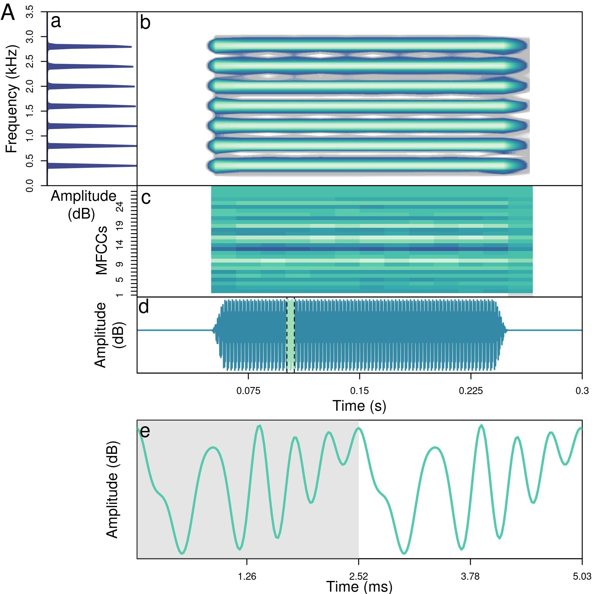
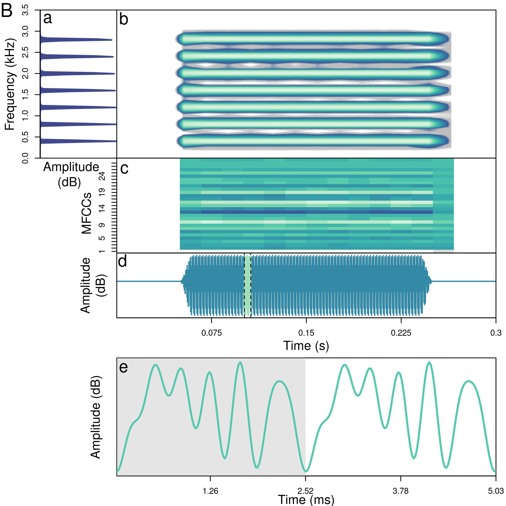
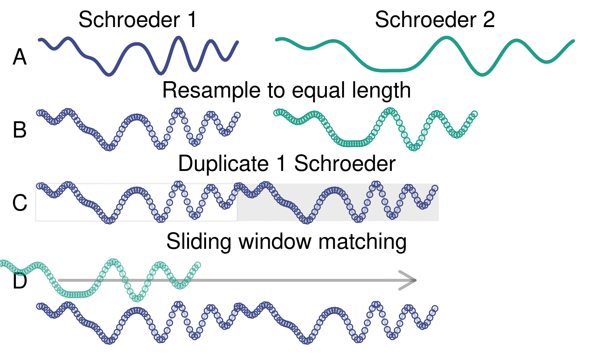

```{r add link to github repo, echo = FALSE, results='asis'}

# print link to github repo if any
if (file.exists("../.git/config")) {
  config <- readLines("../.git/config")
  url <- grep("url", config, value = TRUE)
  url <- gsub("\\turl = |.git$", "", url)
  cat("\nSource code and data found at [", url, "](", url, ")", sep = "")
}

```

```{r load packages and setup style, echo = FALSE, message = FALSE, warning=FALSE}

# github packages must include user name ("user/package")
pkgs <- c("kableExtra", "knitr", "formatR", "seewave", "tuneR", "warbleR", "viridis", "Rraven", github = "maRce10/baRulho", "ggplot2", github = "marce10/PhenotypeSpace", "ecodist", "numform", "animation")

# install/ load packages
sketchy::load_packages(pkgs, quite = TRUE)

# options to customize chunk outputs
knitr::opts_chunk$set(
  class.source = "numberLines lineAnchors", # for code line numbers
  tidy.opts = list(width.cutoff = 65),
  tidy = TRUE,
  message = FALSE
)

knitr::opts_knit$set(root.dir = "..")

```


&nbsp; 

<!-- skyblue box -->

<div class="alert alert-info">

# Purpose

- Compare methods for measuring fine scale structural variation and periodicity in schroeders

</div>

&nbsp;

<!-- light brown box -->
<div class="alert alert-warning">

# Report overview

  - [Synthetizing schroeders](#synthetizing-schroeders)
  - [Measuring schroeder dissimilarity](#measuring-schroeder-dissimilarity)
  - [Takeaways](#takeaways)

</div>

&nbsp;
```{r}

source("~/Dropbox/Projects/geographic_call_variation_yellow-naped_amazon/scripts/MRM2.R")

warbleR_options(parallel = 22)

wave_col <- viridis(10)[7]

```


# Synthetizing schroeders

## Function to make schroeders

```{r}

qwindpc <- function(rftime, srate, sig) {
  ramppts <- round((rftime / 1000) * srate)
  hold1 <- seq(0, 1, length.out = ramppts + 1)
  onramp <- sin(0.5 * pi * hold1)^2
  offramp <- cos(0.5 * pi * hold1)^2
  steady <- rep(1, length(sig) - (2 * ramppts) - 2)
  wind <- c(onramp, steady, offramp)

  if (length(wind) > length(sig)) {
    print("Window not applied, block too short for window")
  } else {
    sig <- wind * sig
  }

  return(sig)
}


make_rep_schroeder <-
  function(samp.rate = 44100,
           f0,
           dur = 1000,
           save.wave = FALSE,
           plot = TRUE,
           n.components,
           scalar = 1,
           color = wave_col,
           path = ".",
           file.name = NULL,
           random.start = FALSE,
           mfrow =  c(2, 1),
           par = TRUE,
           cex.oscillo = 1,
           ...) {
    
      # duplicate duration if starting randomly
    dur.mult <- if (random.start)  2 else 1
    
    # set time instances at which samples will be "taken"
    t <- seq(1 / samp.rate, 1, by = 1 / samp.rate)
    sumwavepos <- rep(0, samp.rate)

    durpts <- round((dur * dur.mult / 1000) * samp.rate)
 
    phase <- rep(0, n.components)
    amplin <- rep(1, n.components)
    f <- rep(0, n.components)

    Ns <- 1:n.components

    for (n in Ns) {
      compnum <- n
      phase[compnum] <- scalar * pi * compnum * (compnum - 1) / n.components
      f[n] <- f0 + ((compnum - 1) * f0)
    }

    wave <- matrix(0, nrow = n.components, ncol = length(t))

    for (i in Ns) {
      wave[i, ] <- amplin[i] * cos((2 * pi * f[i] * t) + phase[i])
      sumwavepos <- sumwavepos + wave[i, ]
    }

    # make sumwapos longer so it fit the target duration    
    org.sumwavepos <- sumwavepos
        
    while(length(sumwavepos) < durpts) 
        sumwavepos <- c(sumwavepos, org.sumwavepos) 

    posschr <- sumwavepos[1:durpts] / max(abs(sumwavepos[1:durpts]))

    # plot(t[1:length(posschr)], posschr, type = "l")

    spectr <- fft(sumwavepos)
    power <- abs(spectr)^2
    sample <- length(t) / max(t)
    freq <- (1:length(t)) * sample / length(t)
    powerdb <- 10 * log10(power[1:(length(t) / 2)])

    if (random.start){
        strt <- sample(1:(length(posschr) / 2), 1)
        posschr <- posschr[strt:(strt + (length(posschr) / 2) - 1)]
    }
    
     posschr <- qwindpc(10, samp.rate, posschr)
    posschr <- posschr / max(abs(posschr))
    
    wave_obj <- tuneR::normalize(tuneR::Wave(posschr, samp.rate = samp.rate, bit = 16), unit = "16")

    if (plot) {
      opar <- par()
      opar$cin <- opar$cra <- opar$sci <- opar$cxy <- opar$din <- opar$csi <- opar$page <- NULL

      # on.exit(par(opar))
      if (par)
      par(mfrow = mfrow, mar = c(5, 4, 0, 0) + 0.1)
      
      plot(
        freq[1:(length(t) / 2)],
        powerdb,
        type = "l",
        xlim = c(0, 5200),
        xlab = "Frequency (Hz)",
        ylab = "Power(dB)",
        col =  color,
        ... 
      )

      seewave::oscillo(wave = wave_obj, colwave = color, cexlab = cex.oscillo, cexaxis = cex.oscillo)
    }

    # Save audio to a file
    if (save.wave) {
      if (is.null(file.name)) {
        file.name <- paste0("f0-", f0, "_ncomp-", n.components, "_", if (scalar == 1) "pos" else "neg", ".wav")
      }
    writeWave(object = wave_obj, filename = file.path(path, file.name), extensible = FALSE)
    
    } else {
      return(wave_obj)
    }
  }

make_single_schroeder <-
  function(samp.rate = 44100,
           f0,
           # dur = 1000,
           save.wave = FALSE,
           plot = TRUE,
           n.components,
           scalar = 1,
           color = wave_col,
           path = ".",
           file.name = NULL,
           mfrow = c(1, 1),
           par = TRUE,
           cex.oscillo = 1,
           add.margin = TRUE,
           ...) {
    
    # set time instances at which samples will be "taken"
    t <- seq(1 / samp.rate, 1, by = 1 / samp.rate)
    sumwavepos <- rep(0, samp.rate)
 
    phase <- rep(0, n.components)
    amplin <- rep(1, n.components)
    f <- rep(0, n.components)

    Ns <- 1:n.components

    for (n in Ns) {
      compnum <- n
      phase[compnum] <- scalar * pi * compnum * (compnum - 1) / n.components
      f[n] <- f0 + ((compnum - 1) * f0)
    }

    wave <- matrix(0, nrow = n.components, ncol = length(t))

    for (i in Ns) {
      wave[i, ] <- amplin[i] * cos((2 * pi * f[i] * t) + phase[i])
      sumwavepos <- sumwavepos + wave[i, ]
    }

    schroeder <- sumwavepos[1:(round(samp.rate / f0))]
    schroeder_length <- length(schroeder)
    
    if (plot){
        par(mfrow = mfrow, mar = c(5, 4, 0, 0) + 0.1)
        oscillo(wave = schroeder, f = f0, colwave = color, cexlab = cex.oscillo, cexaxis = cex.oscillo)
    }    
    
    if (add.margin){
        silence <- rep(0, samp.rate / 20)
    schroeder <- c(silence, schroeder, silence)
    }
    
    wave_obj <- tuneR::normalize(tuneR::Wave(schroeder, samp.rate = samp.rate, bit = 16), unit = "16")
    
    # Save audio to a file
    if (save.wave) {
      if (is.null(file.name)) {
        file.name <- paste0("f0-", f0, "_ncomp-", n.components, "_", if (scalar == 1) "pos" else "neg", ".wav")
      }
    writeWave(object = wave_obj, filename = file.path(path, file.name), extensible = FALSE)
    
    return(data.frame(start = length(silence) / samp.rate, end = (length(silence) / samp.rate) + (schroeder_length / samp.rate)))
    
    } else {
      return(wave_obj)
    }
  }

```

## Function to compute MFCC spectrograms
```{r}

mel_spectro <- function(wave, ovlp = 0, wl = 512, palette = viridis::mako, 
                        ncolors = 20, ncep = 20, tlab = 'Time (s)', flab = 'MFCC',
                        flim = NULL, plot = TRUE, axisY = TRUE, axisX = TRUE) {
    
    f <- wave@samp.rate
    
    # Convert flim from kHz to Hz if provided
    if (!is.null(flim)) {
        flim <- flim * 1000
        # Calculate corresponding mel bands
        mel_lim <- 1127 * log(1 + flim/700)
    }
    
    # common setting suggested by Sueur
    mfccs <- melfcc(wave, sr = f, 
                   wintime = wl/f, 
                   hoptime = if (ovlp == 0) wl/f else wl/f *(ovlp/100),
                   numcep = ncep, 
                   nbands = ncep*2, 
                   fbtype = "htkmel", 
                   dcttype = "t3",
                   htklifter = TRUE, 
                   lifterexp = ncep - 1, 
                   frames_in_rows = FALSE, 
                   spec_out = TRUE,
                   minfreq = if (!is.null(flim)) flim[1] else 0,
                   maxfreq = if (!is.null(flim)) flim[2] else f/2)
    
    # convert NAs to 0s
    mat <- t(mfccs$cepstra)
    mat[is.na(mat)] <- max(mat, na.rm = TRUE)

    # and plotting
    if (plot){
    image(mat, col = palette(ncolors), axes = FALSE, xlab = tlab, ylab = flab, xaxs="i",yaxs="i")
    at <- seq(0, 1, length = 5)
    times <- round(seq(0, duration(wave), length = 5), 2)
    at_times <- times <- pretty(times)
    at_times <- at_times / duration(wave)
   
    # rescale x to deal with extra room in image() plot
    rng_usr <- range(par()$usr)
    at_times <- rng_usr[1] + ( (at_times - 0) / (1 - 0) ) * (rng_usr[2] - rng_usr[1])

if (axisX)
     axis(side = 1, at = at_times, labels = times)
     
if (axisY)
    axis(side = 2, at = 0:(ncep - 1)/(ncep - 1), labels = 1:ncep)
    box()
    } else {
        out <- list(time = round(seq(0, duration(wave), length = nrow(mat)), 2), mfcc = 1:ncep, amp = mat)
        
        return(out)
    }
    
}

```


### Schroeder at 700 Hz with 7 components (harmonics) 

Positive
```{r}


ss <- make_single_schroeder(
  n.components = 7,
  samp.rate = 44100,
  f0 = 400,
  dur = 25,
  save.wave = FALSE,
  plot = TRUE,
  scalar = -1,
  color = viridis(10)[3], random.start = FALSE
)


ms <- make_rep_schroeder(
  n.components = 7,
  samp.rate = 44100,
  f0 = 400,
  dur = 25,
  save.wave = FALSE,
  plot = TRUE,
  scalar = -1,
  color = viridis(10)[3], random.start = FALSE
)


```

Negative
```{r}

ms <- make_single_schroeder(
  n.components = 7,
  samp.rate = 44100,
  f0 = 400,
  dur = 25,
  save.wave = FALSE,
  plot = TRUE,
  scalar = -1,
  color = viridis(10)[3]
)

ms <- make_rep_schroeder(
  n.components = 7,
  samp.rate = 44100,
  f0 = 400,
  dur = 25,
  save.wave = FALSE,
  plot = TRUE,
  scalar = -1,
  color = viridis(10)[3]
)


```

### Schroeder with 10 components

Positive
```{r}

ms <- make_single_schroeder(
  n.components = 10,
  samp.rate = 44100,
  f0 = 400,
  dur = 25,
  save.wave = FALSE,
  plot = TRUE,
  scalar = 1,
  color = viridis(10)[3]
)

ms <- make_rep_schroeder(
  n.components = 10,
  samp.rate = 44100,
  f0 = 400,
  dur = 25,
  save.wave = FALSE,
  plot = TRUE,
  scalar = 1,
  color = viridis(10)[3]
)

```

Negative
```{r}

ms <- make_single_schroeder(
  n.components = 10,
  samp.rate = 44100,
  f0 = 400,
  dur = 25,
  save.wave = FALSE,
  plot = TRUE,
  scalar = -1,
  color = viridis(10)[3]
)

ms <- make_rep_schroeder(
  n.components = 10,
  samp.rate = 44100,
  f0 = 400,
  dur = 25,
  save.wave = FALSE,
  plot = TRUE,
  scalar = -1,
  color = viridis(10)[3]
)

```

Make example video (or gif):
```{r, eval= FALSE}

ani.options(ani.res = 200, ani.width = 1700, ani.height = 1000, ani.type = "png")

## make sure ImageMagick has been installed in your system
# gifs <- function(lng_dat, type = "gif"){ 
  
  # anni_fun <- if(type == "gif") saveGIF else saveVideo
  
  
  saveGIF(expr = {

  for(i in 1:13){
  par(mfcol = c(2, 2), mar = c(5, 5, 3, 2) + 0.1)

ms <- make_rep_schroeder(
  n.components = i,
  samp.rate = 44100,
  f0 = 400,
  dur = 25,
  save.wave = FALSE,
  plot = TRUE,
  scalar = 1,
  color = viridis(10)[3], random.start = FALSE,
  par = FALSE, 
  main = paste0("Positive, ", i, " components"),
  cex.main = 2, cex.lab = 2, cex.oscillo = 2
)

ms <- make_rep_schroeder(
  n.components = i,
  samp.rate = 44100,
  f0 = 400,
  dur = 25,
  save.wave = FALSE,
  plot = TRUE,
  scalar = -1,
  color = viridis(10)[8], random.start = FALSE,
  par = FALSE,
  main = paste0("Negative, ", i, " components"),
    cex.main = 2, cex.lab = 2, cex.oscillo = 2
)

  }

  
}, video.name = file.path("./output/movies", "schroeders_by_sign_and_harmonics2"), interval = 1)
# }, movie.name = paste0(z,  ".", type), interval = 0.05)
# }

```

{width=700}

## Make schroeders


Full factorial design of the following features:

 - Components: from 5 to 25 (21 values)
 - Fundamental frequency: from 200 to 800 (7 values)
 - Phase: 1 and -1
 - 294 schroeders
 
Create schroeders as individual sound files: 

- 200 ms duration schroeders
```{r, eval = FALSE}

shr_tab <- expand.grid(type = c(-1, 1), components = seq(5, 25, 1), f0 = seq(200, 800, 100))

nrow(shr_tab)


shr_tab$name <- paste0(f_pad_zero(x = 1:nrow(shr_tab), width = 3), "_f0-", shr_tab$f0, "_ncomp-", shr_tab$components, "_", ifelse(shr_tab$type == 1, "pos", "neg"), ".wav")

out <- warbleR:::pblapply_wrblr_int(seq_len(nrow(shr_tab)), function(x) {
  make_rep_schroeder(
    n.components = shr_tab$components[x],
    samp.rate = 44100,
    f0 = shr_tab$f0[x],
    dur = 200,
    save.wave = TRUE,
    plot = FALSE,
    scalar = shr_tab$type[x],
    color = "red",
    path = "./data/processed/200ms_schroeders",
    file.name = shr_tab$name[x]
  )
})

```

- Single Schroeders
```{r, eval = FALSE}

shr_tab <- expand.grid(type = c(-1, 1), components = seq(5, 25, 1), f0 = seq(200, 800, 100))

nrow(shr_tab)

shr_tab$name <- paste0(f_pad_zero(x = 1:nrow(shr_tab), width = 3), "_f0-", shr_tab$f0, "_ncomp-", shr_tab$components, "_", ifelse(shr_tab$type == 1, "pos", "neg"), ".wav")

out <- warbleR:::pblapply_wrblr_int(seq_len(nrow(shr_tab)), function(x) {
 df <- make_single_schroeder(
    n.components = shr_tab$components[x],
    samp.rate = 44100,
    f0 = shr_tab$f0[x],
    dur = 200,
    save.wave = TRUE,
    plot = FALSE,
    scalar = shr_tab$type[x],
    color = "red",
    path = "./data/processed/single_schroeders",
    file.name = shr_tab$name[x]
  )
df$sound.files <- shr_tab$name[x]
df$selec <- x
 
return(df)
 })

single_anns <- do.call(rbind, out)

write.csv(single_anns, "./data/processed/single_schroeders_annotations.csv", row.names = FALSE)

est_single_schr <- warbleR::selection_table(single_anns, path = "./data/processed/single_schroeders", extended = TRUE)

saveRDS(est_single_schr, "./data/processed/extended_selection_table_single_schroeders.RDS")

```

Put single Schroeders into an extended selection table:
```{r, eval = FALSE}

# fix start
est_schr <- warbleR::selection_table(whole.recs = TRUE, path = "./data/processed/200ms_schroeders", extended = TRUE)

est_schr$bottom.freq <- (as.numeric(gsub("f0-", "", (sapply(strsplit(est_schr$sound.files, split = "_"), "[[", 2)))) - 50) / 1000

est_schr$top.freq <- freq_range(X = est_schr, threshold = 2, fsmooth = 0.8, parallel = 13)$top.freq

est_schr$f0 <- gsub("f0-", "", sapply(strsplit(est_schr$sound.files, split = "_"), "[[", 2))

est_schr$label <- gsub("os.wav_1|eg.wav_1", "", sapply(strsplit(est_schr$sound.files, split = "ncomp-"), "[[", 2))

saveRDS(est_schr, "./data/processed/extended_selection_table_200ms_schroeders.RDS")

master <- master_sound_file(X = est_schr, file.name = "200ms_schroeder_master", dest.path = "./data/processed/", gap.duration = 0.8, cex = 14)

write.csv(master, "./data/processed/master_annotations_200ms_schroeders.csv", row.names = FALSE)

master$f0 <- c("start_marker", paste("f0", est_schr$f0), "")

master$label <- c("marker", est_schr$label, "marker")

Rraven::exp_raven(master, file.name = "200ms_schroeders", path = "./data/processed/", sound.file.path = "./data/processed/")

```

Put repeated Schroeders into a extended selection table and a single sound file:
```{r, eval = FALSE}

# fix start
est_schr <- warbleR::selection_table(whole.recs = TRUE, path = "./data/processed/200ms_schroeders", extended = TRUE)

est_schr$bottom.freq <- (as.numeric(gsub("f0-", "", (sapply(strsplit(est_schr$sound.files, split = "_"), "[[", 2)))) - 50) / 1000

est_schr$top.freq <- freq_range(X = est_schr, threshold = 2, fsmooth = 0.8, parallel = 13)$top.freq

est_schr$f0 <- gsub("f0-", "", sapply(strsplit(est_schr$sound.files, split = "_"), "[[", 2))

est_schr$label <- gsub("os.wav_1|eg.wav_1", "", sapply(strsplit(est_schr$sound.files, split = "ncomp-"), "[[", 2))

saveRDS(est_schr, "./data/processed/extended_selection_table_200ms_schroeders.RDS")

master <- master_sound_file(X = est_schr, file.name = "200ms_schroeder_master", dest.path = "./data/processed/", gap.duration = 0.8, cex = 14)

write.csv(master, "./data/processed/master_annotations_200ms_schroeders.csv", row.names = FALSE)

master$f0 <- c("start_marker", paste("f0", est_schr$f0), "")

master$label <- c("marker", est_schr$label, "marker")

Rraven::exp_raven(master, file.name = "200ms_schroeders", path = "./data/processed/", sound.file.path = "./data/processed/")

# warbleR::full_spectrograms(master, path = "./data/processed/", sxrow = duration(readWave("./data/processed/200ms_schroeder_master.wav")) / 12, rows = 12, horizontal = TRUE, dest.path = "./data/processed/spectrograms", collevels = seq(-150, 0, 5), labels = "label", song = "f0", wl = 2000)

```

{fig-align="center" width=100%}


```{r export data for SAP}
#| eval: false

exp_est(est_schr, path = "./data/raw/extended_selection_table_schroeders_clips",file.name = "annotations")

est_schr <- resample_est(est_schr, bit.depth = 32)

#add silence
for(i in seq_len(nrow(est_schr))){
wv <- read_sound_file(est_schr, index = i)
wv <- normalize(wv, unit = "32")

# make it a 200 ms cut
wv <- cutw(wave = wv, from = 0, to = 0.1, output = "Wave")
# sil <- runif(min = min(wv@left) / 7, max = max(wv@left) / 7, n = wv@samp.rate / 10)
# wv@left <- c(sil, wv@left, sil)
# wv <- addsilw(wave = wv, at = "end", d = 0.1, f = 44100, output = "Wave", )
# wv <- addsilw(wave = wv, at = "start", d = 0.1, f = 44100, output = "Wave")
spectro(wv)

filename <- file.path("./data/raw/extended_selection_table_schroeders_clips/100ms", gsub("_1$", "",est_schr$sound.files[i]))

writeWave(object = wv, filename = filename, extensible = FALSE)
}

# fix_wavs(path = "./data/raw/extended_selection_table_schroeders_clips/200ms")

```


# Measuring schroeder dissimilarity

We try 11 methods for measuring acoustic structure:

- [Dynamic time warping (DTW) distances from schroeder waveform](#waveform-dtw)
- [Raven's spectrographic features](#ravens-spectrographic-features)
- [warbleR's spectrographic features](#warblers-spectrographic-features)
- [warbleR's MFCC features](#warblers-mfcc-features)
- [warbleR's cross-correlation of fourier spectrograms](#warblers-fourier-cross-correlation)
- [Raven's cross-correlation of fourier spectrograms](#ravens-fourier-cross-correlation)
- [Raven's waveform correlation](#ravens-waveform-correlation)
- [warbleR's cross-correlation of mel-frequency spectrograms](#warblers-mel-frequency-cross-correlation)
- [DTW on warbleR's dominant frequency contours](#dtw-on-warblers-dominant-frequency-contours)
- [DTW on Raven's peak frequency contours](#dtw-on-ravens-peak-frequency-contours)
- [Sound Analysis Pro similarity](#sap-similarity)

Statistical modeling:

- [Multiple Regression on distance Matrices](https://search.r-project.org/CRAN/refmans/ecodist/html/MRM.html) 
 - Model:   
 \begin{align*}
 Dissimilarity &\sim frequency + components + phase
 \end{align*}
- Response values scaled to make effect sizes comparable across models
- Predictors were coded as pairwise binary matrices in which 0 means that calls in a dyad belong to the same level and 1 means calls belong to different levels 

## Waveform DTW

- Using waveforms of 200 ms with repeated schroeders
- Both Schroeders have the same length
- One is duplicated and the other one is slide across the duplicated one
- The minimum DTW distance is kept as a dissimilarity measure

```{r, eval = FALSE}

schroeders <- readRDS("./data/processed/extended_selection_table_200ms_schroeders.RDS")

nms <- names(schroeders)
# nms <- grep(pattern = "200|400|600|800", nms, value = TRUE)

cmbs <- t(combn(schroeders$sound.files, 2))


min_dist_l <- pbapply::pbsapply(cl = 22, 1:nrow(cmbs), function(x) {
  s1 <- read_sound_file(schroeders, index = which(schroeders$sound.files == cmbs[x, 1]))@left
 s2 <- read_sound_file(schroeders, index = which(schroeders$sound.files == cmbs[x, 2]))@left

 # normalize
 s1 <- s1 / max(abs(s1))
 s2 <- s2 / max(abs(s2))
 
  # make same length
  # if (length(s1) != length(s2))
  s1 <- approx(s1, n = 100)$y
  s2 <- approx(s2, n = 100)$y

  # duplicate 1
  s1 <- rep(s1, 2)

  # run dtw over longer vector
  dists <- vapply(seq_len(length(s1) - length(s2)), function(x) {
    segment <- s1[x:min(c(x + length(s2) - 1), length(s1))]

    dtw_dist <- dtw::dtwDist(mx = rbind(s2, segment))
    return(dtw_dist[1, 2])
  }, FUN.VALUE = numeric(1))


  return(data.frame(schr1 = cmbs[x, 1], schr2 = cmbs[x, 2], min(dists)))
})

min_dists <- do.call(rbind, min_dist_l)

min_dists <- as.data.frame(matrix(min_dists[, 1], ncol = 3, byrow = TRUE))

names(min_dists) <- c("schr1", "schr2", "dist")

min_dists$dist <- as.numeric(min_dists$dist)

saveRDS(min_dists, "./data/processed/dtw_distance_ac_segments_200ms_schroeders.RDS")
```

```{r, eval=FALSE}

min_dists <- readRDS("./data/processed/dtw_distance_ac_segments_200ms_schroeders.RDS")

min_dists$dist <- scale(min_dists$dist)

dist_tri <- PhenotypeSpace::rectangular_to_triangular(min_dists)

freq_bi_tri <- as.dist(binary_triangular_matrix(group = sapply(strsplit(rownames(dist_tri), "_"), "[[", 2)))

comp_bi_tri <- as.dist(binary_triangular_matrix(group = gsub("_n|_p", "", sapply(strsplit(rownames(dist_tri), "_"), "[[", 3))))

sign_bi_tri <- as.dist(binary_triangular_matrix(group = sapply(strsplit(rownames(dist_tri), "_"), "[[", 4)))

rect_var <- cbind(as.dist(dist_tri), freq_bi_tri, comp_bi_tri, sign_bi_tri)

colnames(rect_var) <- c("dtw_dist", "frequency", "components", "sign")

dtw_wv_mod <- MRM2(formula = dtw_dist ~ frequency + components + sign, nperm = 10000, mat = rect_var)

saveRDS(
  dtw_wv_mod,
  "./data/processed/matrix_correlation_dtw_distance_200ms_schroeders.RDS"
)
```

```{r}

(dtw_wv_mod <- readRDS("./data/processed/matrix_correlation_dtw_distance_200ms_schroeders.RDS"))

```

## Single Schroeder DTW

- Using a single replicate of each Schroeder
- Both Schroeders have the same length
- One is duplicated and the other one is slide across the duplicated one
- The minimum DTW distance is kept as a dissimilarity measure

```{r, eval = FALSE}

single_schroeders <- readRDS("./data/processed/extended_selection_table_single_schroeders.RDS")

nms <- names(single_schroeders)
# nms <- grep(pattern = "200|400|600|800", nms, value = TRUE)

cmbs <- t(combn(single_schroeders$sound.files, 2))


min_dist_l <- pbapply::pbsapply(cl = 22, 1:nrow(cmbs), function(x) {
  s1 <- read_sound_file(single_schroeders, index = which(single_schroeders$sound.files == cmbs[x, 1]))@left
 s2 <- read_sound_file(single_schroeders, index = which(single_schroeders$sound.files == cmbs[x, 2]))@left

 # normalize
 s1 <- s1 / max(abs(s1))
 s2 <- s2 / max(abs(s2))
 
  # make same length
  # if (length(s1) != length(s2))
  s1 <- approx(s1, n = 100)$y
  s2 <- approx(s2, n = 100)$y

  # duplicate 1
  s1 <- rep(s1, 2)

  # run dtw over longer vector
  dists <- vapply(seq_len(length(s1) - length(s2)), function(x) {
    segment <- s1[x:min(c(x + length(s2) - 1), length(s1))]

    dtw_dist <- dtw::dtwDist(mx = rbind(s2, segment))
    return(dtw_dist[1, 2])
  }, FUN.VALUE = numeric(1))


  return(data.frame(schr1 = cmbs[x, 1], schr2 = cmbs[x, 2], min(dists)))
})

min_dists <- do.call(rbind, min_dist_l)

min_dists <- as.data.frame(matrix(min_dists[, 1], ncol = 3, byrow = TRUE))

names(min_dists) <- c("schr1", "schr2", "dist")

min_dists$dist <- as.numeric(min_dists$dist)

saveRDS(min_dists, "./data/processed/dtw_distance_ac_segments_single_schroeders.RDS")
```

```{r, eval=FALSE}

min_dists <- readRDS("./data/processed/dtw_distance_ac_segments_single_schroeders.RDS")

min_dists$dist <- scale(min_dists$dist)

dist_tri <- PhenotypeSpace::rectangular_to_triangular(min_dists)

freq_bi_tri <- as.dist(binary_triangular_matrix(group = sapply(strsplit(rownames(dist_tri), "_"), "[[", 2)))

comp_bi_tri <- as.dist(binary_triangular_matrix(group = gsub("_n|_p", "", sapply(strsplit(rownames(dist_tri), "_"), "[[", 3))))

sign_bi_tri <- as.dist(binary_triangular_matrix(group = sapply(strsplit(rownames(dist_tri), "_"), "[[", 4)))

rect_var <- cbind(as.dist(dist_tri), freq_bi_tri, comp_bi_tri, sign_bi_tri)

colnames(rect_var) <- c("dtw_dist", "frequency", "components", "sign")

dtw_wv_mod <- MRM2(formula = dtw_dist ~ frequency + components + sign, nperm = 10000, mat = rect_var)

saveRDS(
  sngl_dtw_wv_mod,
  "./data/processed/matrix_correlation_dtw_distance_single_schroeders.RDS"
)
```

```{r}

(sngl_dtw_wv_mod <- readRDS("./data/processed/matrix_correlation_dtw_distance_single_schroeders.RDS"))

```

## Waveform correlation

- Both Schroeders have the same length

```{r, eval = FALSE}

schroeders <- readRDS("./data/processed/extended_selection_table_200ms_schroeders.RDS")

nms <- names(schroeders)

cmbs <- t(combn(schroeders$sound.files, 2))


min_dist_l <- pbapply::pbsapply(cl = 20, 1:nrow(cmbs), function(x) {
  s1 <- read_sound_file(schroeders, index = which(schroeders$sound.files == cmbs[x, 1]))@left
 s2 <- read_sound_file(schroeders, index = which(schroeders$sound.files == cmbs[x, 2]))@left

 # normalize
 s1 <- s1 / max(abs(s1))
 s2 <- s2 / max(abs(s2))
 
  # make same length
  # if (length(s1) != length(s2))
  s1 <- approx(s1, n = 100)$y
  s2 <- approx(s2, n = 100)$y

  # duplicate 1
  # s1 <- rep(s1, 2)

 # run correlation
  cor <- cor(s1, s2)

  return(data.frame(schr1 = cmbs[x, 1], schr2 = cmbs[x, 2], cor = cor))
})

cors <- do.call(rbind, min_dist_l)

cors <- as.data.frame(matrix(cors[, 1], ncol = 3, byrow = TRUE))

names(cors) <- c("schr1", "schr2", "cor")

cors$cor <- as.numeric(cors$cor)

saveRDS(cors, "./data/processed/waveform_correlation_200ms_schroeders.RDS")
```


```{r, eval=FALSE}

cors <- readRDS("./data/processed/waveform_correlation_200ms_schroeders.RDS")

# make it a distance
cors$cor <- scale(1 - cors$cor)

dist_tri <- PhenotypeSpace::rectangular_to_triangular(cors)

freq_bi_tri <- as.dist(binary_triangular_matrix(group = sapply(strsplit(rownames(dist_tri), "_"), "[[", 2)))

comp_bi_tri <- as.dist(binary_triangular_matrix(group = gsub("_n|_p", "", sapply(strsplit(rownames(dist_tri), "_"), "[[", 3))))

sign_bi_tri <- as.dist(binary_triangular_matrix(group = sapply(strsplit(rownames(dist_tri), "_"), "[[", 4)))

rect_var <- cbind(as.dist(dist_tri), freq_bi_tri, comp_bi_tri, sign_bi_tri)

colnames(rect_var) <- c("dtw_dist", "frequency", "components", "sign")

cor_wv_mod <- MRM2(formula = dtw_dist ~ frequency + components + sign, nperm = 10000, mat = rect_var)

saveRDS(
  cor_wv_mod,
  "./data/processed/matrix_correlation_waveform_correlation_200ms_schroeders.RDS"
)
```

```{r}

(cor_wv_mod <- readRDS("./data/processed/matrix_correlation_waveform_correlation_200ms_schroeders.RDS"))

```

## Single schroeder correlation

- Both Schroeders have the same length

```{r, eval = FALSE}

schroeders <- readRDS("./data/processed/extended_selection_table_single_schroeders.RDS")

nms <- names(schroeders)

cmbs <- t(combn(schroeders$sound.files, 2))


min_dist_l <- pbapply::pbsapply(cl = 20, 1:nrow(cmbs), function(x) {
  s1 <- read_sound_file(schroeders, index = which(schroeders$sound.files == cmbs[x, 1]))@left
 s2 <- read_sound_file(schroeders, index = which(schroeders$sound.files == cmbs[x, 2]))@left

 # normalize
 s1 <- s1 / max(abs(s1))
 s2 <- s2 / max(abs(s2))
 
  # make same length
  # if (length(s1) != length(s2))
  s1 <- approx(s1, n = 100)$y
  s2 <- approx(s2, n = 100)$y

  # duplicate 1
  # s1 <- rep(s1, 2)

 # run correlation
  cor <- cor(s1, s2)

  return(data.frame(schr1 = cmbs[x, 1], schr2 = cmbs[x, 2], cor = cor))
})

cors <- do.call(rbind, min_dist_l)

cors <- as.data.frame(matrix(cors[, 1], ncol = 3, byrow = TRUE))

names(cors) <- c("schr1", "schr2", "cor")

cors$cor <- as.numeric(cors$cor)

saveRDS(cors, "./data/processed/waveform_correlation_single_schroeders.RDS")
```

```{r, eval=FALSE}

cors <- readRDS("./data/processed/waveform_correlation_single_schroeders.RDS")

# make it a distance
cors$cor <- scale(1 - cors$cor)

dist_tri <- PhenotypeSpace::rectangular_to_triangular(cors)

freq_bi_tri <- as.dist(binary_triangular_matrix(group = sapply(strsplit(rownames(dist_tri), "_"), "[[", 2)))

comp_bi_tri <- as.dist(binary_triangular_matrix(group = gsub("_n|_p", "", sapply(strsplit(rownames(dist_tri), "_"), "[[", 3))))

sign_bi_tri <- as.dist(binary_triangular_matrix(group = sapply(strsplit(rownames(dist_tri), "_"), "[[", 4)))

rect_var <- cbind(as.dist(dist_tri), freq_bi_tri, comp_bi_tri, sign_bi_tri)

colnames(rect_var) <- c("dtw_dist", "frequency", "components", "sign")

sngl_cor_wv_mod <- MRM2(formula = dtw_dist ~ frequency + components + sign, nperm = 10000, mat = rect_var)

saveRDS(
  sngl_cor_wv_mod,
  "./data/processed/matrix_correlation_waveform_correlation_single_schroeders.RDS"
)
```

```{r}

(sngl_cor_wv_mod <- readRDS("./data/processed/matrix_correlation_waveform_correlation_single_schroeders.RDS"))

```

## Raven's spectrographic features
```{r, eval = FALSE}

rav_dat <- imp_raven(path = "./data/processed", files = "200ms_schroeders.txt", warbler.format = TRUE, all.data = TRUE)

rav_dat <- rav_dat[grep(pattern = "marker", rav_dat$sound.id, invert = TRUE), ]

rav_dat <- rav_dat[, grep("contour|PFC Slope", ignore.case = TRUE, x = names(rav_dat), invert = TRUE)]

pca <- prcomp(x = rav_dat[, names(rav_dat) %in% c("Agg Entropy (bits)", "Avg Entropy (bits)", "Avg Power Density (dB FS/Hz)", "BW 50% (Hz)", "BW 90% (Hz)", "Center Freq (Hz)", "Center Time Rel.", "Delta Freq (Hz)", "Dur 50% (s)", "Dur 90% (s)", "Energy (dB FS)", "Freq 25% (Hz)", "Freq 5% (Hz)", "Freq 75% (Hz)", "Freq 95% (Hz)", "Inband Power (dB FS)", "Max Entropy (bits)", "Max Freq (Hz)", "Min Entropy (bits)", "Peak Freq (Hz)", "PFC Avg Slope (Hz/ms)", "PFC Max Freq (Hz)", "PFC Max Slope (Hz/ms)", "PFC Min Freq (Hz)", "PFC Min Slope (Hz/ms)", "PFC Num Inf Pts", "Peak Power Density (dB FS/Hz)", "Peak Time (s)", "Peak Time Relative", "Time 25% (s)", "Time 25% Rel.", "Time 5% (s)", "Time 5% Rel.", "Time 75% (s)", "Time 75% Rel.", "Time 95% (s)", "Time 95% Rel.")], scale. = TRUE)

rav_dat$pc1 <- pca$x[, 1]
rav_dat$pc2 <- pca$x[, 2]
rav_dat$comp <- sapply(strsplit(rav_dat$label, "_"), "[[", 1)
rav_dat$sign <- sapply(strsplit(rav_dat$label, "_"), "[[", 2)
rav_dat$label <- paste(rav_dat$f0, rav_dat$label, sep = "-")

dist_tri <- dist(rav_dat[, c("pc1", "pc2")])

freq_bi_tri <- as.dist(binary_triangular_matrix(group = rav_dat$f0))

comp_bi_tri <- as.dist(binary_triangular_matrix(group = rav_dat$comp))

sign_bi_tri <- as.dist(binary_triangular_matrix(group = rav_dat$sign))

rect_var <- cbind(as.dist(scale(as.matrix(dist_tri))), freq_bi_tri, comp_bi_tri, sign_bi_tri)

colnames(rect_var) <- c("rav_dist", "frequency", "components", "sign")


rav_mod <- MRM2(formula = rav_dist ~ frequency + components + sign, nperm = 10000, mat = rect_var)

saveRDS(
  rav_mod,
  "./data/processed/matrix_correlation_raven_measurements_distance_200ms_schroeders.RDS"
)
```

```{r}
(rav_mod <- readRDS("./data/processed/matrix_correlation_raven_measurements_distance_200ms_schroeders.RDS"))
```

## warbleR's spectrographic features
```{r, eval = FALSE}

est_schr <- readRDS("./data/processed/extended_selection_table_200ms_schroeders.RDS")

wsp <- spectro_analysis(est_schr, harmonicity = TRUE, nharmonics = 5, parallel = 20)

# keep columns with no NAs
wsp <- wsp[complete.cases(wsp), ]

pca <- prcomp(x = wsp[, -c(1:3)])
wsp$pc1 <- pca$x[, 1]
wsp$pc2 <- pca$x[, 2]

wsp_tri <- dist(wsp[, c("pc1", "pc2")])

freq_bi_tri <- as.dist(binary_triangular_matrix(group = substr(sapply(strsplit(wsp$sound.files, "_"), "[[", 2), start = 4, 6)))

comp_bi_tri <- as.dist(binary_triangular_matrix(group = substr(sapply(strsplit(wsp$sound.files, "_"), "[[", 3), start = 7, 8)))

sign_bi_tri <- as.dist(binary_triangular_matrix(group = ifelse(grepl("pos", wsp$sound.files), "pos", "neg")))

rect_var <- cbind(as.dist(scale(as.matrix(wsp_tri))), freq_bi_tri, comp_bi_tri, sign_bi_tri)

colnames(rect_var) <- c("wrbl_sp", "frequency", "components", "sign")

wrbl_mod <- MRM2(formula = wrbl_sp ~ frequency + components + sign, nperm = 10000, mat = rect_var)

saveRDS(
  wrbl_mod,
  "./data/processed/matrix_correlation_warbler_measurements_distance_200ms_schroeder.RDS"
)
```

```{r}

(wrbl_mod <- readRDS("./data/processed/matrix_correlation_warbler_measurements_distance_200ms_schroeder.RDS"))

```

## warbleR's MFCC features
```{r, eval = FALSE}

est_schr <- readRDS("./data/processed/extended_selection_table_200ms_schroeders.RDS")

wsp <- mfcc_stats(est_schr)

# keep columns with no NAs
wsp <- wsp[complete.cases(wsp), ]

pca <- prcomp(x = wsp[, -c(1:3)])
wsp$pc1 <- pca$x[, 1]
wsp$pc2 <- pca$x[, 2]

wsp_tri <- dist(wsp[, c("pc1", "pc2")])

freq_bi_tri <- as.dist(binary_triangular_matrix(group = substr(sapply(strsplit(wsp$sound.files, "_"), "[[", 2), start = 4, 6)))

comp_bi_tri <- as.dist(binary_triangular_matrix(group = substr(sapply(strsplit(wsp$sound.files, "_"), "[[", 3), start = 7, 8)))

sign_bi_tri <- as.dist(binary_triangular_matrix(group = ifelse(grepl("pos", wsp$sound.files), "pos", "neg")))

rect_var <- cbind(as.dist(scale(as.matrix(wsp_tri))), freq_bi_tri, comp_bi_tri, sign_bi_tri)

colnames(rect_var) <- c("wrbl_sp", "frequency", "components", "sign")

mfcc_wrbl_mod <- MRM2(formula = wrbl_sp ~ frequency + components + sign, nperm = 10000, mat = rect_var)

saveRDS(
  mfcc_wrbl_mod,
  "./data/processed/mfcc_warbler_distance_200ms_schroeders.RDS"
)
```

```{r}

(mfcc_wrbl_mod <- readRDS("./data/processed/mfcc_warbler_distance_200ms_schroeders.RDS"))
```

## warbleR's fourier cross-correlation
```{r, eval = FALSE}

est_schr <- readRDS("./data/processed/extended_selection_table_200ms_schroeders.RDS")

# mimicking raven
xc <- cross_correlation(est_schr, ovlp = 50, parallel = 20, wl = 512, bp = c(0, 22), wn = "hamming")

saveRDS(xc, "./data/processed/fourier_cross_correlation_200ms_schroeders.RDS")

```

```{r, eval = FALSE}

xc <- readRDS("./data/processed/fourier_cross_correlation_200ms_schroeders.RDS")

freq_bi_tri <- as.dist(binary_triangular_matrix(group = substr(sapply(strsplit(rownames(xc), "_"), "[[", 2), start = 4, 6)))

comp_bi_tri <- as.dist(binary_triangular_matrix(group = substr(sapply(strsplit(rownames(xc), "_"), "[[", 3), start = 7, 8)))

sign_bi_tri <- as.dist(binary_triangular_matrix(group = ifelse(grepl("pos", rownames(xc)), "pos", "neg")))

rect_var <- cbind(as.dist(scale(1 - xc)), freq_bi_tri, comp_bi_tri, sign_bi_tri)

colnames(rect_var) <- c("fourier_xc", "frequency", "components", "sign")

xc_mod <- MRM2(formula = fourier_xc ~ frequency + components + sign, nperm = 10000, mat = rect_var)

saveRDS(
  xc_mod,
  "./data/processed/matrix_correlation_fourier_cross_correlation_200ms_schroeders.RDS"
)
```

```{r}

(xc_mod <- readRDS("./data/processed/matrix_correlation_fourier_cross_correlation_200ms_schroeders.RDS"))

```

## Raven's fourier cross-correlation

- Hamming window function
- 512 samples FFT
- Un-normalized
- bandpass 0-22 kHz


```{r, eval = FALSE}

xc_rav <- Rraven::imp_corr_mat(file = "BatchCorrOutput_v3_hamming.txt", path = "./data/processed")[[1]]

freq_bi_tri <- as.dist(binary_triangular_matrix(group = substr(sapply(strsplit(rownames(xc_rav), "_"), "[[", 2), start = 4, 6)))

comp_bi_tri <- as.dist(binary_triangular_matrix(group = substr(sapply(strsplit(rownames(xc_rav), "_"), "[[", 3), start = 7, 8)))

sign_bi_tri <- as.dist(binary_triangular_matrix(group = ifelse(grepl("pos", rownames(xc_rav)), "pos", "neg")))

rect_var <- cbind(as.dist(scale(1 - xc_rav)), freq_bi_tri, comp_bi_tri, sign_bi_tri)

colnames(rect_var) <- c("fourier_xc_rav", "frequency", "components", "sign")

xc_rav_mod <- MRM2(formula = fourier_xc_rav ~ frequency + components + sign, nperm = 10000, mat = rect_var)

saveRDS(
  xc_rav_mod,
  "./data/processed/matrix_correlation_raven_fourier_cross_correlation_200ms_schroeders.RDS"
)

```

```{r}

(xc_rav_mod <- readRDS("./data/processed/matrix_correlation_raven_fourier_cross_correlation_200ms_schroeders.RDS"))

```

## Raven's waveform correlation
```{r, eval = FALSE}

wav_cr_rav <- Rraven::imp_corr_mat(file = "raven_waveform_correlation_200ms_schroeders.txt", path = "./data/processed")[[1]]

freq_bi_tri <- as.dist(binary_triangular_matrix(group = substr(sapply(strsplit(rownames(wav_cr_rav), "_"), "[[", 2), start = 4, 6)))

comp_bi_tri <- as.dist(binary_triangular_matrix(group = substr(sapply(strsplit(rownames(wav_cr_rav), "_"), "[[", 3), start = 7, 8)))

sign_bi_tri <- as.dist(binary_triangular_matrix(group = ifelse(grepl("pos", rownames(wav_cr_rav)), "pos", "neg")))

rect_var <- cbind(as.dist(scale(1 - wav_cr_rav)), freq_bi_tri, comp_bi_tri, sign_bi_tri)

colnames(rect_var) <- c("fourier_wav_cr_rav", "frequency", "components", "sign")

wav_cr_rav_mod <- MRM2(formula = fourier_wav_cr_rav ~ frequency + components + sign, nperm = 10000, mat = rect_var)

saveRDS(
  wav_cr_rav_mod,
  "./data/processed/matrix_correlation_raven_waveform_correlation_200ms_schroeders.RDS"
)

```

```{r}

(wav_cr_rav_mod <- readRDS("./data/processed/matrix_correlation_raven_waveform_correlation_200ms_schroeders.RDS"))

```

## warbleR's mel-frequency cross-correlation
```{r, eval = FALSE}

est_schr <- readRDS("./data/processed/extended_selection_table_200ms_schroeders.RDS")

xc <- cross_correlation(est_schr, type = "mfcc")

saveRDS(xc, "./data/processed/mel_frequency_cross_correlation_200ms_schroeders.RDS")

```

```{r, eval=FALSE}

xc <- readRDS("./data/processed/mel_frequency_cross_correlation_200ms_schroeders.RDS")

freq_bi_tri <- as.dist(binary_triangular_matrix(group = substr(sapply(strsplit(rownames(xc), "_"), "[[", 2), start = 4, 6)))

comp_bi_tri <- as.dist(binary_triangular_matrix(group = substr(sapply(strsplit(rownames(xc), "_"), "[[", 3), start = 7, 8)))

sign_bi_tri <- as.dist(binary_triangular_matrix(group = ifelse(grepl("pos", rownames(xc)), "pos", "neg")))

rect_var <- cbind(as.dist(scale(1 - xc)), freq_bi_tri, comp_bi_tri, sign_bi_tri)


colnames(rect_var) <- c("mel_xc", "frequency", "components", "sign")


mxc_mod <- MRM2(formula = mel_xc ~ frequency + components + sign, nperm = 10000, mat = rect_var)

saveRDS(
  mxc_mod,
  "./data/processed/matrix_correlation_mel_cross_correlation_200ms_schroeders.RDS"
)
```

```{r}

(mxc_mod <- readRDS("./data/processed/matrix_correlation_mel_cross_correlation_200ms_schroeders.RDS"))

```

## DTW on warbleR's dominant frequency contours
```{r, eval = FALSE}

est_schr <- readRDS("./data/processed/extended_selection_table_200ms_schroeders.RDS")

dtw_dists <- freq_DTW(est_schr, type = "dominant", img = FALSE)

saveRDS(dtw_dists, "./data/processed/dtw_distance_dominant_frequency_200ms_schroeders.RDS")

```

```{r, eval=FALSE}

dtw_dists <- readRDS("./data/processed/dtw_distance_dominant_frequency_200ms_schroeders.RDS")

freq_bi_tri <- as.dist(binary_triangular_matrix(group = substr(sapply(strsplit(rownames(dtw_dists), "_"), "[[", 2), start = 4, 6)))

comp_bi_tri <- as.dist(binary_triangular_matrix(group = substr(sapply(strsplit(rownames(dtw_dists), "_"), "[[", 3), start = 7, 8)))

sign_bi_tri <- as.dist(binary_triangular_matrix(group = ifelse(grepl("pos", rownames(dtw_dists)), "pos", "neg")))

rect_var <- cbind(as.dist(scale(dtw_dists)), freq_bi_tri, comp_bi_tri, sign_bi_tri)

colnames(rect_var) <- c("dtw_dists", "frequency", "components", "sign")

dtw_dom_mod <- MRM2(formula = dtw_dists ~ frequency + components + sign, nperm = 10000, mat = rect_var)

saveRDS(
  dtw_dom_mod,
  "./data/processed/matrix_correlation_dtw_distances_dominant_frequency_contours_200ms_schroeders.RDS"
)
```

```{r}

(dtw_dom_mod <- readRDS("./data/processed/matrix_correlation_dtw_distances_dominant_frequency_contours_200ms_schroeders.RDS"))

```

## DTW on Raven's peak frequency contours
```{r, eval = FALSE}

source("~/Dropbox/R_package_testing/warbleR/R/freq_DTW.R")
source("~/Dropbox/R_package_testing/warbleR/R/internal_functions.R")

rav_dat <- imp_raven(path = "./data/processed", files = "200ms_schroeders.txt", warbler.format = TRUE, all.data = TRUE)

rav_dat <- rav_dat[grep(pattern = "marker", rav_dat$sound.id, invert = TRUE), ]

# rav_dat <- rav_dat[, grep("contour|PFC Slope", ignore.case = TRUE, x = names(rav_dat), invert = TRUE)]

rav_freq_cntr <- extract_ts(rav_dat, ts.column = "Peak Freq Contour (Hz)", equal.length = TRUE)


est_schr <- readRDS("./data/processed/extended_selection_table_200ms_schroeders.RDS")

rav_dtw_dists <- freq_DTW(est_schr, ts.df = rav_freq_cntr, type = "dominant", img = FALSE)

rownames(rav_dtw_dists) <- rav_dat$sound.id

saveRDS(rav_dtw_dists, "./data/processed/dtw_distance_raven_dominant_frequency_200ms_schroeders.RDS")

```

```{r, eval=FALSE}

rav_dtw_dists <- readRDS("./data/processed/dtw_distance_raven_dominant_frequency_200ms_schroeders.RDS")

freq_bi_tri <- as.dist(binary_triangular_matrix(group = substr(sapply(strsplit(rownames(rav_dtw_dists), "_"), "[[", 2), start = 4, 6)))

comp_bi_tri <- as.dist(binary_triangular_matrix(group = substr(sapply(strsplit(rownames(rav_dtw_dists), "_"), "[[", 3), start = 7, 8)))

sign_bi_tri <- as.dist(binary_triangular_matrix(group = ifelse(grepl("pos", rownames(rav_dtw_dists)), "pos", "neg")))

rect_var <- cbind(as.dist(scale(rav_dtw_dists)), freq_bi_tri, comp_bi_tri, sign_bi_tri)

colnames(rect_var) <- c("rav_dtw_dists", "frequency", "components", "sign")

source("~/Dropbox/Projects/geographic_call_variation_yellow-naped_amazon/scripts/MRM2.R")

dtw_rav_peak_mod <- MRM2(formula = rav_dtw_dists ~ frequency + components + sign, nperm = 10000, mat = rect_var)

saveRDS(
  dtw_rav_peak_mod,
  "./data/processed/matrix_correlation_dtw_distances_raven_dominant_frequency_contours_200ms_schroeders.RDS"
)
```

```{r}

(dtw_rav_peak_mod <- readRDS("./data/processed/matrix_correlation_dtw_distances_raven_dominant_frequency_contours_200ms_schroeders.RDS"))

```


## SAP similarity

- SAP: sound analysis pro
- This analysis was done on 200 ms clips as longer clips did not run in SAP

```{r, eval = FALSE}

simil_sap <- readxl::read_xlsx("./data/raw/200ms_SAPsim.xlsx")

# fix weird similarities
simil_sap$`%Similarity`[simil_sap$Accuracy == -1] <- mean(simil_sap$`%Similarity`, na.rm = TRUE)

#number of pairwise comparisons posibles
clips <- unique(c(simil_sap$`Sound 1`, simil_sap$`Sound 2`))

ncol(poss_combs <- combn(clips, 2))

poss_combs <- t(poss_combs)

poss_dyad <- sapply(seq_len(nrow(poss_combs)), function(x) {
  paste(sort(c(poss_combs[x, 1], poss_combs[x, 2])), collapse = "|")
})


simil_sap$dyad <- sapply(seq_len(nrow(simil_sap)), function(x) {
  paste(sort(c(simil_sap$`Sound 1`[x], simil_sap$`Sound 2`[x])), collapse = "|")
})

# remove duplicated dyads
simil_sap <- simil_sap[!duplicated(simil_sap$dyad), ]

# remove self comparisons
simil_sap <- simil_sap[! simil_sap$`Sound 1` == simil_sap$`Sound 2`,]

nrow(simil_sap)

# missing dyads
missing <- poss_dyad[!poss_dyad %in% simil_sap$dyad]

# split missing by |
missing <- unique(c(sapply(strsplit(missing, "|", fixed = TRUE), "[[", 1), sapply(strsplit(missing, "|", fixed = TRUE), "[[", 2)))

# remove missing clips
simil_sap <- simil_sap[!(simil_sap$`Sound 1` %in% missing | simil_sap$`Sound 2` %in% missing),]

# get symmetric triangular matrix
dist_sap <- rectangular_to_triangular(as.data.frame(simil_sap))

freq_bi_tri <- as.dist(binary_triangular_matrix(group = substr(sapply(strsplit(rownames(dist_sap), "_"), "[[", 2), start = 4, 6)))

comp_bi_tri <- as.dist(binary_triangular_matrix(group = substr(sapply(strsplit(rownames(dist_sap), "_"), "[[", 3), start = 7, 8)))

sign_bi_tri <- as.dist(binary_triangular_matrix(group = ifelse(grepl("pos", rownames(dist_sap)), "pos", "neg")))

rect_var <- cbind(as.dist(scale(1 - dist_sap)), freq_bi_tri, comp_bi_tri, sign_bi_tri)

colnames(rect_var) <- c("dist_sap", "frequency", "components", "sign")

rect_var[is.na(rect_var[,1]), 1] <- mean(rect_var[,1], na.rm = TRUE)

dist_sap_mod <- MRM2(formula = dist_sap ~ frequency + components + sign, nperm = 10000, mat = rect_var)

saveRDS(
  dist_sap_mod,
  "./data/processed/matrix_correlation_sound_analysis_pro_200_ms_clips.RDS"
)

```

```{r}

(dist_sap_mod <- readRDS("./data/processed/matrix_correlation_sound_analysis_pro_200_ms_clips.RDS"))

```

## SAP accuracy

- SAP: sound analysis pro
- This analysis was done on 200 ms clips as longer clips did not run in SAP

```{r, eval = FALSE}

simil_sap <- readxl::read_xlsx("./data/raw/200ms_SAPsim.xlsx")

# fix weird similarities
simil_sap$Accuracy[simil_sap$Accuracy == -1] <- mean(simil_sap$Accuracy[simil_sap$Accuracy != -1], na.rm = TRUE)

#number of pairwise comparisons posibles
clips <- unique(c(simil_sap$`Sound 1`, simil_sap$`Sound 2`))

ncol(poss_combs <- combn(clips, 2))

poss_combs <- t(poss_combs)

poss_dyad <- sapply(seq_len(nrow(poss_combs)), function(x) {
  paste(sort(c(poss_combs[x, 1], poss_combs[x, 2])), collapse = "|")
})


simil_sap$dyad <- sapply(seq_len(nrow(simil_sap)), function(x) {
  paste(sort(c(simil_sap$`Sound 1`[x], simil_sap$`Sound 2`[x])), collapse = "|")
})

# remove duplicated dyads
simil_sap <- simil_sap[!duplicated(simil_sap$dyad), ]

# remove self comparisons
simil_sap <- simil_sap[! simil_sap$`Sound 1` == simil_sap$`Sound 2`,]

nrow(simil_sap)

# missing dyads
missing <- poss_dyad[!poss_dyad %in% simil_sap$dyad]

# split missing by |
missing <- unique(c(sapply(strsplit(missing, "|", fixed = TRUE), "[[", 1), sapply(strsplit(missing, "|", fixed = TRUE), "[[", 2)))

# remove missing clips
simil_sap <- simil_sap[!(simil_sap$`Sound 1` %in% missing | simil_sap$`Sound 2` %in% missing),]

# get symmetric triangular matrix
dist_sap <- rectangular_to_triangular(as.data.frame(simil_sap[, c("Sound 1", "Sound 2", "Accuracy")]))

freq_bi_tri <- as.dist(binary_triangular_matrix(group = substr(sapply(strsplit(rownames(dist_sap), "_"), "[[", 2), start = 4, 6)))

comp_bi_tri <- as.dist(binary_triangular_matrix(group = substr(sapply(strsplit(rownames(dist_sap), "_"), "[[", 3), start = 7, 8)))

sign_bi_tri <- as.dist(binary_triangular_matrix(group = ifelse(grepl("pos", rownames(dist_sap)), "pos", "neg")))

rect_var <- cbind(as.dist(scale(1 - dist_sap)), freq_bi_tri, comp_bi_tri, sign_bi_tri)

colnames(rect_var) <- c("dist_sap", "frequency", "components", "sign")

rect_var[is.na(rect_var[,1]), 1] <- mean(rect_var[,1], na.rm = TRUE)

acc_sap_mod <- MRM2(formula = dist_sap ~ frequency + components + sign, nperm = 10000, mat = rect_var)

saveRDS(
  acc_sap_mod,
  "./data/processed/matrix_correlation_sound_analysis_pro_accuracy_200_ms_clips.RDS"
)

```

```{r}

(acc_sap_mod <- readRDS("./data/processed/matrix_correlation_sound_analysis_pro_accuracy_200_ms_clips.RDS"))

```


## SAP harmonic goodness

- SAP: sound analysis pro
- This analysis was done on 200 ms clips as longer clips did not run in SAP

```{r, eval = FALSE}

simil_sap <- readxl::read_xlsx("./data/raw/200ms_SAPsim.xlsx")


#number of pairwise comparisons posibles
clips <- unique(c(simil_sap$`Sound 1`, simil_sap$`Sound 2`))

ncol(poss_combs <- combn(clips, 2))

poss_combs <- t(poss_combs)

poss_dyad <- sapply(seq_len(nrow(poss_combs)), function(x) {
  paste(sort(c(poss_combs[x, 1], poss_combs[x, 2])), collapse = "|")
})


simil_sap$dyad <- sapply(seq_len(nrow(simil_sap)), function(x) {
  paste(sort(c(simil_sap$`Sound 1`[x], simil_sap$`Sound 2`[x])), collapse = "|")
})

# remove duplicated dyads
simil_sap <- simil_sap[!duplicated(simil_sap$dyad), ]

# remove self comparisons
simil_sap <- simil_sap[! simil_sap$`Sound 1` == simil_sap$`Sound 2`,]

nrow(simil_sap)

# missing dyads
missing <- poss_dyad[!poss_dyad %in% simil_sap$dyad]

# split missing by |
missing <- unique(c(sapply(strsplit(missing, "|", fixed = TRUE), "[[", 1), sapply(strsplit(missing, "|", fixed = TRUE), "[[", 2)))

# remove missing clips
simil_sap <- simil_sap[!(simil_sap$`Sound 1` %in% missing | simil_sap$`Sound 2` %in% missing),]

# convert to distance
simil_sap$`Goodness diff` <- simil_sap$`Goodness diff` * -1

# get symmetric triangular matrix
dist_sap <- rectangular_to_triangular(as.data.frame(simil_sap[, c("Sound 1", "Sound 2", "Goodness diff")]))

freq_bi_tri <- as.dist(binary_triangular_matrix(group = substr(sapply(strsplit(rownames(dist_sap), "_"), "[[", 2), start = 4, 6)))

comp_bi_tri <- as.dist(binary_triangular_matrix(group = substr(sapply(strsplit(rownames(dist_sap), "_"), "[[", 3), start = 7, 8)))

sign_bi_tri <- as.dist(binary_triangular_matrix(group = ifelse(grepl("pos", rownames(dist_sap)), "pos", "neg")))

rect_var <- cbind(as.dist(scale(1 - dist_sap)), freq_bi_tri, comp_bi_tri, sign_bi_tri)

colnames(rect_var) <- c("dist_sap", "frequency", "components", "sign")

rect_var[is.na(rect_var[,1]), 1] <- mean(rect_var[,1], na.rm = TRUE)

good_sap_mod <- MRM2(formula = dist_sap ~ frequency + components + sign, nperm = 10000, mat = rect_var)

saveRDS(
  good_sap_mod,
  "./data/processed/matrix_correlation_sound_analysis_pro_goodness_200_ms_clips.RDS"
)

```

```{r}

(good_sap_mod <- readRDS("./data/processed/matrix_correlation_sound_analysis_pro_goodness_200_ms_clips.RDS"))

```


## SAP pitch difference

- SAP: sound analysis pro
- This analysis was done on 200 ms clips as longer clips did not run in SAP

```{r, eval = FALSE}

simil_sap <- readxl::read_xlsx("./data/raw/200ms_SAPsim.xlsx")

#number of pairwise comparisons posibles
clips <- unique(c(simil_sap$`Sound 1`, simil_sap$`Sound 2`))

ncol(poss_combs <- combn(clips, 2))

poss_combs <- t(poss_combs)

poss_dyad <- sapply(seq_len(nrow(poss_combs)), function(x) {
  paste(sort(c(poss_combs[x, 1], poss_combs[x, 2])), collapse = "|")
})


simil_sap$dyad <- sapply(seq_len(nrow(simil_sap)), function(x) {
  paste(sort(c(simil_sap$`Sound 1`[x], simil_sap$`Sound 2`[x])), collapse = "|")
})

# remove duplicated dyads
simil_sap <- simil_sap[!duplicated(simil_sap$dyad), ]

# remove self comparisons
simil_sap <- simil_sap[! simil_sap$`Sound 1` == simil_sap$`Sound 2`,]

nrow(simil_sap)

# missing dyads
missing <- poss_dyad[!poss_dyad %in% simil_sap$dyad]

# split missing by |
missing <- unique(c(sapply(strsplit(missing, "|", fixed = TRUE), "[[", 1), sapply(strsplit(missing, "|", fixed = TRUE), "[[", 2)))

# remove missing clips
simil_sap <- simil_sap[!(simil_sap$`Sound 1` %in% missing | simil_sap$`Sound 2` %in% missing),]

# convert to distance
simil_sap$`Pitch diff` <- simil_sap$`Pitch diff` * -1


# get symmetric triangular matrix
dist_sap <- rectangular_to_triangular(as.data.frame(simil_sap[, c("Sound 1", "Sound 2", "Pitch diff")]))

freq_bi_tri <- as.dist(binary_triangular_matrix(group = substr(sapply(strsplit(rownames(dist_sap), "_"), "[[", 2), start = 4, 6)))

comp_bi_tri <- as.dist(binary_triangular_matrix(group = substr(sapply(strsplit(rownames(dist_sap), "_"), "[[", 3), start = 7, 8)))

sign_bi_tri <- as.dist(binary_triangular_matrix(group = ifelse(grepl("pos", rownames(dist_sap)), "pos", "neg")))

rect_var <- cbind(as.dist(scale(1 - dist_sap)), freq_bi_tri, comp_bi_tri, sign_bi_tri)

colnames(rect_var) <- c("dist_sap", "frequency", "components", "sign")

rect_var[is.na(rect_var[,1]), 1] <- mean(rect_var[,1], na.rm = TRUE)

pitch_diff_mod <- MRM2(formula = dist_sap ~ frequency + components + sign, nperm = 10000, mat = rect_var)

saveRDS(
  pitch_diff_mod,
  "./data/processed/matrix_correlation_sound_analysis_pro_pitch_diff_200_ms_clips.RDS"
)

```

```{r}

(pitch_diff_mod <- readRDS("./data/processed/matrix_correlation_sound_analysis_pro_pitch_diff_200_ms_clips.RDS"))

```

## SAP amplitude modulation

- SAP: sound analysis pro
- This analysis was done on 200 ms clips as longer clips did not run in SAP

```{r, eval = FALSE}

simil_sap <- readxl::read_xlsx("./data/raw/200ms_SAPsim.xlsx")

#number of pairwise comparisons posibles
clips <- unique(c(simil_sap$`Sound 1`, simil_sap$`Sound 2`))

ncol(poss_combs <- combn(clips, 2))

poss_combs <- t(poss_combs)

poss_dyad <- sapply(seq_len(nrow(poss_combs)), function(x) {
  paste(sort(c(poss_combs[x, 1], poss_combs[x, 2])), collapse = "|")
})


simil_sap$dyad <- sapply(seq_len(nrow(simil_sap)), function(x) {
  paste(sort(c(simil_sap$`Sound 1`[x], simil_sap$`Sound 2`[x])), collapse = "|")
})

# remove duplicated dyads
simil_sap <- simil_sap[!duplicated(simil_sap$dyad), ]

# remove self comparisons
simil_sap <- simil_sap[! simil_sap$`Sound 1` == simil_sap$`Sound 2`,]

nrow(simil_sap)

# missing dyads
missing <- poss_dyad[!poss_dyad %in% simil_sap$dyad]

# split missing by |
missing <- unique(c(sapply(strsplit(missing, "|", fixed = TRUE), "[[", 1), sapply(strsplit(missing, "|", fixed = TRUE), "[[", 2)))

# remove missing clips
simil_sap <- simil_sap[!(simil_sap$`Sound 1` %in% missing | simil_sap$`Sound 2` %in% missing),]

# get symmetric triangular matrix
dist_sap <- rectangular_to_triangular(as.data.frame(simil_sap[, c("Sound 1", "Sound 2", "AM diff")]))

freq_bi_tri <- as.dist(binary_triangular_matrix(group = substr(sapply(strsplit(rownames(dist_sap), "_"), "[[", 2), start = 4, 6)))

comp_bi_tri <- as.dist(binary_triangular_matrix(group = substr(sapply(strsplit(rownames(dist_sap), "_"), "[[", 3), start = 7, 8)))

sign_bi_tri <- as.dist(binary_triangular_matrix(group = ifelse(grepl("pos", rownames(dist_sap)), "pos", "neg")))

rect_var <- cbind(as.dist(scale(1 - dist_sap)), freq_bi_tri, comp_bi_tri, sign_bi_tri)

colnames(rect_var) <- c("dist_sap", "frequency", "components", "sign")

rect_var[is.na(rect_var[,1]), 1] <- mean(rect_var[,1], na.rm = TRUE)

am_sap_mod <- MRM2(formula = dist_sap ~ frequency + components + sign, nperm = 10000, mat = rect_var)

saveRDS(
  am_sap_mod,
  "./data/processed/matrix_correlation_sound_analysis_pro_amplitude_modulation_200_ms_clips.RDS"
)

```

```{r}

(am_sap_mod <- readRDS("./data/processed/matrix_correlation_sound_analysis_pro_amplitude_modulation_200_ms_clips.RDS"))

```


## Combined results
```{r, fig.cap = "Effect sizes per model and predictor (color intensity shows effect size magnitude relative to the highest effect size within the model).", out.width="100%", fig.width=12, fig.height=4}

mods <- list(
    'waveform DTW (wblR, rep)' = dtw_wv_mod,
    'waveform DTW (wblR, sngl)' = sngl_dtw_wv_mod,
    'waveform correlation (wblR, rep)' = cor_wv_mod,
    'waveform correlation (wblR, sngl)' = sngl_cor_wv_mod,
    'spectro-temporal features (wblR)' = wrbl_mod,
    'MFCC descriptors (wblR)' = mfcc_wrbl_mod,
    'spectro-temporal features (Rvn)' = rav_mod,
    'linear freq. cross-correlation (wblR)' = xc_mod,
    'mel freq. cross-correlation (wblR)' = mxc_mod,
    'peak freq. DTW (wblR)' = dtw_dom_mod,
    'peak freq. DTW (Rvn+wlbR)' = dtw_rav_peak_mod,
    'waveform correlation (Rvn, rep)' = wav_cr_rav_mod,
    'linear freq. cross-correlation (Rvn)' = xc_rav_mod,
    'harmonic goodness (SAP)' = good_sap_mod,
    'pitch differences (SAP)' = pitch_diff_mod,
    'amplitude modulation (SAP)' = am_sap_mod
)
estimates <- do.call(rbind, lapply(seq_along(mods), function(x) {
  Y <- data.frame(mods[[x]]$coef[-1, ])
  Y$rel_coef <- Y[, 1] / max(Y[, 1])
  Y$mod <- names(mods)[x]
  Y$predictor <- rownames(Y)
  names(Y) <- c("coef", "p", "rel_coef", "model", "predictor")
  return(Y)
}))

estimates$rel_coef <- ifelse(estimates$p < 0.05, estimates$rel_coef, 0)
estimates$signif <- ifelse(estimates$p < 0.05, "p < 0.05", "p >= 0.05")

# sort factor level by rel_coef
estimates$model <- factor(estimates$model, levels = estimates$model[estimates$predictor == "sign"][order(estimates$rel_coef[estimates$predictor == "sign"], decreasing = TRUE)])


estimates$predictor <- gsub("sign", "Phase", estimates$predictor)
estimates$predictor <- levels(factor(estimates$predictor, levels = c("Frequency", "Harmonics", "Phase")))


gg_effects <- ggplot(estimates, aes(x = predictor, y = model, fill = coef)) +
  geom_tile() +
  coord_equal() + 
    scale_fill_gradient2(
low = viridis(10)[3], high = viridis(10)[7],
    guide = "none"
  ) +
  geom_text(aes(label = round(coef, 3), color = signif), size = 3) +
  scale_color_manual(values = c("black", "gray"))+
    labs(x = "", y = "", color = "P value") +
  theme_classic() +
  theme(axis.text.x = element_text(
    color = "black",
    size = 11, angle = 40, vjust = 0.95, hjust = 0.9
  ),
  axis.text.y = element_text(
    color = "black",
    size = 11
  ))

# gg_effects 

gg_effects <- gg_effects + coord_flip()


gg_effects
# 
# ggsave(
#     filename = "./output/combined_effect_sizes.png",
#     plot = gg_effects,
#     width = 12,
#     height = 4,
#     dpi = 300,
#     units = "in"
# )

```


### Subset
```{r, fig.cap = "Effect sizes per model and predictor (color intensity shows effect size magnitude relative to the highest effect size within the model).", out.width="100%", fig.width=12, fig.height=4}

mods <- list(
    'waveform DTW (wblR, rep)' = dtw_wv_mod,
    'waveform DTW (wblR, sngl)' = sngl_dtw_wv_mod,
    'waveform correlation (wblR, rep)' = cor_wv_mod,
    'waveform correlation (wblR, sngl)' = sngl_cor_wv_mod,
    'spectro-temporal features (wblR)' = wrbl_mod,
    'MFCC descriptors (wblR)' = mfcc_wrbl_mod,
    'spectro-temporal features (Rvn)' = rav_mod,
    'linear freq. cross-correlation (wblR)' = xc_mod,
    'mel freq. cross-correlation (wblR)' = mxc_mod,
    # 'peak freq. DTW (wblR)' = dtw_dom_mod,
    # 'peak freq. DTW (Rvn+wlbR)' = dtw_rav_peak_mod,
    'waveform correlation (Rvn, rep)' = wav_cr_rav_mod,
    'linear freq. cross-correlation (Rvn)' = xc_rav_mod,
    'harmonic goodness (SAP)' = good_sap_mod,
    'pitch differences (SAP)' = pitch_diff_mod,
    'amplitude modulation (SAP)' = am_sap_mod
)


estimates <- do.call(rbind, lapply(seq_along(mods), function(x) {
  Y <- data.frame(mods[[x]]$coef[-1, ])
  Y$rel_coef <- Y[, 1] / max(Y[, 1])
  Y$mod <- names(mods)[x]
  Y$predictor <- rownames(Y)
  names(Y) <- c("coef", "p", "rel_coef", "model", "predictor")
  return(Y)
}))

estimates$rel_coef <- ifelse(estimates$p < 0.05, estimates$rel_coef, 0)
estimates$signif <- ifelse(estimates$p < 0.05, "p < 0.05", "p >= 0.05")

# sort factor level by rel_coef
estimates$model <- factor(estimates$model, levels = estimates$model[estimates$predictor == "sign"][order(estimates$coef[estimates$predictor == "sign"], decreasing = TRUE)])

estimates$predictor <- gsub("sign", "Phase", estimates$predictor)
estimates$predictor <- levels(factor(estimates$predictor, levels = c("Frequency", "Harmonics", "Phase")))


gg_effects <- ggplot(estimates, aes(x = predictor, y = model, fill = coef)) +
  geom_tile() +
  coord_equal() + 
    scale_fill_gradient2(
low = mako(10)[3], high = mako(10)[7],
    guide = "none"
  ) +
  geom_text(aes(label = round(coef, 3), color = signif), size = 4) +
  scale_color_manual(values = c("black", "gray"))+
    labs(x = "", y = "", color = "P value") +
  theme_classic() +
  theme(axis.text.x = element_text(
    color = "black",
    size = 12, angle = 45, vjust = 0.95, hjust = 0.9
  ),
  axis.text.y = element_text(
    color = "black",
    size = 13
  ))

# gg_effects 

gg_effects <- gg_effects + coord_flip()


gg_effects
# 
# ggsave(
#     filename = "./output/combined_effect_sizes.png",
#     plot = gg_effects,
#     width = 12,
#     height = 4,
#     dpi = 300,
#     units = "in"
# )

```

<div class="alert alert-success">

&nbsp; 

# Takeaways

- Waveform correlation works better at getting periodicity 
- Dynamic time warping dissimilarity on mean periods, Raven's waveform correlation and (to some extent) Fourier cross-correlation did capture phase differences in Schroeders
- Raven waveform correlation remove differences in frequency when forcing all periods to have the same number of values (i.e. same length)

</div>

&nbsp;


# Additional figures


```{r}
#| eval: false

est_schr$sf <- substr(est_schr$sound.files, start = 5, stop = 1000)


grp_df <- data.frame(schr = c("f0-400_ncomp-7_neg.wav_1", "f0-400_ncomp-7_pos.wav_1"), from = c(0.05037, 0.05037), to = c(0.0554, 0.0554))

grp_df[2,2:3] <- grp_df[2,2:3] + 0.00121

flim <- c(0, 3.5)
cx <- 1


est_200ms <- readRDS("./data/processed/extended_selection_table_200ms_schroeders.RDS")

# est_single <- readRDS("./data/processed/extended_selection_table_single_schroeders.RDS")

for (i in 1:nrow(grp_df)){
    
jpeg(file = paste0("./scripts/200ms_schroeders_", grp_df$schr[i], ".jpg"), width = 2000, height = 2000, res = 300)
wv_200ms_1 <- read_sound_file(est_200ms, index = which(est_schr$sf == grp_df$schr[i]))

silence <- rep(0, wv_200ms_1@samp.rate / 20)
schroeder <- c(silence, wv_200ms_1@left, silence)
    
sil_wv_200ms_1 <- tuneR::normalize(tuneR::Wave(schroeder, samp.rate = wv_200ms_1@samp.rate, bit = 16), unit = "16")

mat <- matrix(c(1, 2, 6, 3, 7, 4, 8, 5), ncol = 2, byrow = TRUE)


layout(mat, widths = c(0.3, 1, 0.3, 1, 0.3, 1, 0.3, 1), heights = c(1, 0.6, 0.6))
# 
# layout.show(n = 8)

spc <- seewave::meanspec(wave = wv_200ms_1, plot = FALSE, ovlp = 50, wl = 2100)

par(mar = c(0, 4, 1, 0))

plot(spc[,2:1], type = "l", ylab = "", xlab = "", ylim = flim, col = mako(10)[4], lwd = 2, xaxt = "n",  yaxt = "n", xaxs="i", yaxs="i")
text(x = 0.1, y = flim[2] - 0.2, labels = "a", cex = cx + 1)


 polygon(x = spc[,2], y = spc[,1], col = mako(10)[4], border = NA)

axis(2, cex.axis = cx)

mtext(text = "Frequency (kHz)", side = 2, line = 2.4, adj = 0.5, cex = cx)

mtext(text = "Amplitude    \n(dB)     ", side = 1, line = 2, adj = 0.5, cex = cx)

mtext(ifelse(i == 1, "A", "B"), side=2, line=2.7, at=3.5, las = 1, cex = 1.5)

par(mar = c(0, 0, 1, 1))

# create color palette
cp <- colorRampPalette(c("white", "white","white","white", "gray", "gray",viridis::mako(10, begin = 0.4)))

warbleR:::spectro_wrblr_int2(sil_wv_200ms_1, flim = flim, wl = 800, palette = cp, grid = FALSE, collevels = seq(-60, 0, 1), ovlp = 10, zp = 100, axisY = FALSE, flab = "", axisX = FALSE)

text(x = 0.0055, y = flim[2] - 0.2, labels = "b", cex = cx + 1)

cp2 <- colorRampPalette(c(viridis::mako(10, begin = 0.4), "gray", "white"))

par(mar = c(0, 0, 0, 1))
mel_spectro(addsilw(sil_wv_200ms_1, at = "start", d = 0.002, output = "Wave"), flim = flim, wl = 800, palette = cp2, ncep = 29, ovlp = 90, axisY = FALSE, axisX = FALSE)

text(x = -0.008, y = 0.9, labels = "c", cex = cx + 1)

axis(2, cex.axis = cx, at = seq(0, 1, length.out = 29)[1:28], labels = 1:28)

mtext(text = "MFCCs", side = 2, line = 2.4, adj = 0.35, cex = cx)


par(mar = c(3, 0, 0, 1))

plot(sil_wv_200ms_1@left, type = "l", xlab = "", col = mako(10)[6], lwd = 1.6, xaxt = "n", yaxt = "n", xaxs="i")

text(x = 200, y = 20000, labels = "d", cex = cx + 1)

mtext(text = "Amplitude\n(dB)", side = 2, line = 1, cex = cx)


indx <- round(0.101 * sil_wv_200ms_1@samp.rate, 0):round(0.106 * sil_wv_200ms_1@samp.rate, 0)
sub <- sil_wv_200ms_1@left[indx]

lines(x = indx, y = sub, type = "l", col = mako(10)[9], lwd = 2)


abline(v = 0.101 * sil_wv_200ms_1@samp.rate, col = "gray4", lty = 2)

abline(v = 0.106 * sil_wv_200ms_1@samp.rate, col = "gray4", lty = 2)


at <- seq(0, length.out = 5, by = 0.2 * length(sil_wv_200ms_1@left))

labs <- seq(0, duration(sil_wv_200ms_1), length.out = 5)

at <- labs * sil_wv_200ms_1@samp.rate

axis(1, at = at, labels = labs, cex.axis = cx)

mtext(text = "Time (s)", side = 1, line = 2.4, adj = 0.5, cex = cx)


par(mar = c(3, 0, 1, 1))


# clp_200ms_1 <- read_sound_file(est_single, index = which(est_schr$sf == schr1))
# 
# clp_200ms_1@left <- c(clp_200ms_1@left, clp_200ms_1@left) 

clp_200ms_1 <- cutw(wv_200ms_1, from = grp_df$from[i], to = grp_df$to[i], output = "Wave", units = "seconds")

plot(clp_200ms_1@left, type = "l", ylab = "Amplitude", xlab = "", col = mako(10)[8], lwd = 2.4, xaxt = "n", yaxt = "n", xaxs="i")

mtext(text = "Amplitude (dB)", side = 2, line =1.5, adj = 0.5, cex = cx)


at <- seq(0, length.out = 5, by = 0.2 * length(sil_wv_200ms_1@left))

labs <- seq(0, duration(clp_200ms_1), length.out = 5)

at <- labs * sil_wv_200ms_1@samp.rate 

labs <- round(labs * 1000, 2)

axis(1, at = at, labels = labs, cex.axis = cx)

mtext(text = "Time (ms)", side = 1, line = 2, adj = 0.5, cex = cx)
 rect(xleft = 0, xright = duration(clp_200ms_1) / 2 * sil_wv_200ms_1@samp.rate, ybottom = -100000, ytop = 1000000, , col = adjustcolor("gray", 
                    0.4), border = NA)


lines(x = seq_along(clp_200ms_1@left), y = clp_200ms_1@left, type = "l", col = mako(10)[8], lwd = 2.4)

text(x = 5, y = 22000, labels = "e", cex = cx + 1)

dev.off()
}

```
 
 
::: {#fig-Schroeders-multipannel layout-ncol=2}
{#fig-negative}

{#fig-positive}
:::

```{r}

ss1 <- make_single_schroeder(
  n.components = 7,
  samp.rate = 44100,
  f0 = 400,
  dur = 25,
  save.wave = FALSE,
  plot = FALSE,
  scalar = -1,
  color = viridis(10)[3], 
  random.start = FALSE, 
  add.margin = FALSE
)

# scale between 0 and 1
ss1@left <- (ss1@left - min(ss1@left)) / (max(ss1@left) - min(ss1@left))

ss2 <- make_single_schroeder(
  n.components = 5,
  samp.rate = 44100,
  f0 = 300,
  dur = 25,
  save.wave = FALSE,
  plot = FALSE,
  scalar = -1,
  color = viridis(10)[3], 
  random.start = FALSE, 
  add.margin = FALSE
)

# scale between 0 and 1
ss2@left <- (ss2@left - min(ss2@left)) / (max(ss2@left) - min(ss2@left))

# remove margins
# dev.off()
par(mar = c(0, 0, 0, 0))

cex <- 1.2
point_samp <- 80
pos <- c(0, 1.5, 3, 4.6, 4.7) * 1.3

# empty plot no box
plot(1, type = "n", xlab = "", ylab = "", xlim = c(-0.2, 2.8), ylim = c(-7.5, 2), xaxt = "n", yaxt = "n", 
     bty = "n", xaxs = "i", yaxs = "i")

text(x = - 0.1, y = 0.5, labels = "A", cex = cex)

text(x = 0.5, y = -pos[1] + 1.5, labels = "Schroeder 1", cex = cex)

lines(x = seq(0, 1, along.with = ss1@left), y = ss1@left, col = viridis(10)[3], lwd = 3)

text(x = 2, y = -pos[1] + 1.5, labels = "Schroeder 2", cex = cex)

lines(x = seq(1.2, 2.7, along.with = ss2@left), y = ss2@left, col = viridis(10)[6], lwd = 3)

# approx()


# resample to equal size

text(x = - 0.1, y = -pos[2] +0.5, labels = "B", cex = cex)

text(x = 1.25, y = -pos[2] + 1.5, labels = "Resample to equal length", cex = 1.2)

points(x = seq(0, 1, length.out = point_samp), y = approx(ss1@left, n = point_samp)$y - pos[2],  col = viridis(10)[3], cex = 0.7)

lines(x = seq(0, 1, along.with = ss1@left), y = ss1@left - pos[2], col = viridis(10, alpha = 0.3)[3], lwd = 2)


points(x = seq(1.2, 2.2, length.out = point_samp), y = approx(ss2@left, n = point_samp)$y - pos[2],  col = viridis(10)[6], cex = 0.7)

lines(x = seq(1.2, 2.2, along.with = ss2@left), y = ss2@left - pos[2], col = viridis(10, alpha = 0.3)[6], lwd = 2)

# duplicate
text(x = - 0.1, y = -pos[3] +0.5, labels = "C", cex = cex)

text(x = 1.25, y = -pos[3] + 1.5, labels = "Duplicate 1 Schroeder", cex = 1.2)

points(x = seq(0, 1, length.out = point_samp), y = approx(ss1@left, n = point_samp)$y - pos[3],  col = viridis(10)[3], cex = 0.7)

lines(x = seq(0, 1, along.with = ss1@left), y = ss1@left - pos[3], col = viridis(10, alpha = 0.3)[3], lwd = 2)

#polygon on top
polygon(x = c(0, 1.02, 1.02, 0) + 1, y = c(0, 0, 1, 1) - pos[3], col = adjustcolor("gray", alpha.f = 0.3), border = NA)

polygon(x = c(-0.02, 1, 1, -0.02), y = c(0, 0, 1, 1) - pos[3], col = NA, border = adjustcolor("gray", alpha.f = 0.3))

points(x = seq(1, 2, length.out = point_samp), y = approx(ss1@left, n = point_samp)$y - pos[3],  col = viridis(10)[3], cex = 0.7, pch = 1)

lines(x = seq(0, 1, along.with = ss1@left) + 1, y = ss1@left - pos[3], col = viridis(10, alpha = 0.3)[3], lwd = 2)

# sliding window
text(x = - 0.1, y = -pos[4] + 0.5, labels = "D", cex = cex)

text(x = 1.25, y = -pos[4] + 1.5, labels = "Sliding window matching", cex = 1.2)

for (i in 1:2){
points(x = seq(i-1, i, length.out = point_samp), y = approx(ss1@left, n = point_samp)$y - pos[5] - 1,  col = viridis(10)[3], cex = 0.7, pch = 1)
lines(x = seq(0, 1, along.with = ss1@left) + i - 1, y = ss1@left - pos[5] - 1, col = viridis(10, alpha = 0.3)[3], lwd = 2)
    }

points(x = seq(0, 1, length.out = point_samp) + 0.7, y = approx(ss2@left, n = point_samp)$y - pos[4],  col = viridis(10, alpha = 0.6)[6], cex = 0.7)
 
lines(x = seq(0, 1, along.with = ss2@left) + 0.7, y = ss2@left - pos[4], col = viridis(10, alpha = 0.3)[6], lwd = 2)

alpha <- 0.5

# add arrow
arrows(x0 = 0.1, y0 = -pos[4] + 0.5, x1 = 1.9, y1 = -pos[4] + 0.5, col = adjustcolor("black", alpha.f = 0.3), length = 0.16, lwd = 2.5)

pos_slid <- seq(0.7, -0.2, length.out = 80)

# exponential increase 
alph_slid <- exp(seq(100, 93, length.out = length(pos_slid)))

# force it to range 0-0.15
alph_slid <- alph_slid / max(alph_slid) * 0.15

# alph_slid <- seq(0.15, 0, length.out = 40)

for (i in seq_along(pos_slid)){

    points(x = seq(0, 1, length.out = point_samp) + pos_slid[i], y = approx(ss2@left, n = point_samp)$y - pos[4],  col = viridis(10, alpha = alph_slid[i])[6], cex = 0.7)

}


```


```{r gif}
#| eval: false
#| echo: false

ss1 <- make_single_schroeder(
  n.components = 7,
  samp.rate = 44100,
  f0 = 400,
  dur = 25,
  save.wave = FALSE,
  plot = FALSE,
  scalar = -1,
  color = viridis(10)[3], 
  random.start = FALSE, 
  add.margin = FALSE
)

# scale between 0 and 1
ss1@left <- (ss1@left - min(ss1@left)) / (max(ss1@left) - min(ss1@left))

ss2 <- make_single_schroeder(
  n.components = 5,
  samp.rate = 44100,
  f0 = 300,
  dur = 25,
  save.wave = FALSE,
  plot = FALSE,
  scalar = -1,
  color = viridis(10)[3], 
  random.start = FALSE, 
  add.margin = FALSE
)

# scale between 0 and 1
ss2@left <- (ss2@left - min(ss2@left)) / (max(ss2@left) - min(ss2@left))

# remove margins
# dev.off()

saveGIF({

pos_slid <- seq(0, 1.03, length.out = 20)

for (w in pos_slid){
par(mar = c(0, 0, 0, 0))

cex <- 1.2
point_samp <- 80
pos <- c(0, 1.5, 3, 4.6, 4.7) * 1.3

# empty plot no box
plot(1, type = "n", xlab = "", ylab = "", xlim = c(-0.2, 2.8), ylim = c(-7.5, 2), xaxt = "n", yaxt = "n", 
     bty = "n", xaxs = "i", yaxs = "i")

text(x = - 0.1, y = 0.5, labels = "A", cex = cex)

text(x = 0.5, y = -pos[1] + 1.5, labels = "Schroeder 1", cex = cex)

lines(x = seq(0, 1, along.with = ss1@left), y = ss1@left, col = viridis(10)[3], lwd = 3)

text(x = 2, y = -pos[1] + 1.5, labels = "Schroeder 2", cex = cex)

lines(x = seq(1.2, 2.7, along.with = ss2@left), y = ss2@left, col = viridis(10)[6], lwd = 3)

# approx()


# resample to equal size

text(x = - 0.1, y = -pos[2] +0.5, labels = "B", cex = cex)

text(x = 1.25, y = -pos[2] + 1.5, labels = "Resample to equal length", cex = 1.2)

points(x = seq(0, 1, length.out = point_samp), y = approx(ss1@left, n = point_samp)$y - pos[2],  col = viridis(10)[3], cex = 0.7)

lines(x = seq(0, 1, along.with = ss1@left), y = ss1@left - pos[2], col = viridis(10, alpha = 0.3)[3], lwd = 2)


points(x = seq(1.2, 2.2, length.out = point_samp), y = approx(ss2@left, n = point_samp)$y - pos[2],  col = viridis(10)[6], cex = 0.7)

lines(x = seq(1.2, 2.2, along.with = ss2@left), y = ss2@left - pos[2], col = viridis(10, alpha = 0.3)[6], lwd = 2)

# duplicate
text(x = - 0.1, y = -pos[3] +0.5, labels = "C", cex = cex)

text(x = 1.25, y = -pos[3] + 1.5, labels = "Duplicate 1 Schroeder", cex = 1.2)

points(x = seq(0, 1, length.out = point_samp), y = approx(ss1@left, n = point_samp)$y - pos[3],  col = viridis(10)[3], cex = 0.7)

lines(x = seq(0, 1, along.with = ss1@left), y = ss1@left - pos[3], col = viridis(10, alpha = 0.3)[3], lwd = 2)

#polygon on top
polygon(x = c(0, 1.02, 1.02, 0) + 1, y = c(0, 0, 1, 1) - pos[3], col = adjustcolor("gray", alpha.f = 0.3), border = NA)

polygon(x = c(-0.02, 1, 1, -0.02), y = c(0, 0, 1, 1) - pos[3], col = NA, border = adjustcolor("gray", alpha.f = 0.3))

points(x = seq(1, 2, length.out = point_samp), y = approx(ss1@left, n = point_samp)$y - pos[3],  col = viridis(10)[3], cex = 0.7, pch = 1)

lines(x = seq(0, 1, along.with = ss1@left) + 1, y = ss1@left - pos[3], col = viridis(10, alpha = 0.3)[3], lwd = 2)

# sliding window
text(x = - 0.1, y = -pos[4] + 0.5, labels = "D", cex = cex)

text(x = 1.25, y = -pos[4] + 1.5, labels = "Sliding window matching", cex = 1.2)

for (i in 1:2){
points(x = seq(i-1, i, length.out = point_samp), y = approx(ss1@left, n = point_samp)$y - pos[5] - 1,  col = viridis(10)[3], cex = 0.7, pch = 1)
lines(x = seq(0, 1, along.with = ss1@left) + i - 1, y = ss1@left - pos[5] - 1, col = viridis(10, alpha = 0.3)[3], lwd = 2)
    }


# add arrow
arrows(x0 = 0.1, y0 = -pos[4] + 0.5, x1 = 1.9, y1 = -pos[4] + 0.5, col = adjustcolor("black", alpha.f = 0.3), length = 0.16, lwd = 2.5)

points(x = seq(0, 1, length.out = point_samp) + w, y = approx(ss2@left, n = point_samp)$y - pos[4],  col = viridis(10, alpha = 0.6)[6], cex = 0.7)


lines(x = seq(0, 1, along.with = ss2@left) + w, y = ss2@left - pos[4], col = viridis(10, alpha = 0.3)[6], lwd = 2)


}
    }, movie.name =  "sliding_window_waveform.gif", interval = 0.1, ani.height = 480 *2, ani.width = 800 * 2, ani.res = 300)

file.copy("sliding_window_waveform.gif", "./output/movies/sliding_window_waveform.gif", overwrite = TRUE)

file.copy("sliding_window_waveform.gif", "./scripts/sliding_window_waveform.gif", overwrite = TRUE)
```




```{r}
if (!knitr::is_html_output(excludes = "markdown"))
    jpeg(file = "./output/4_schroeders.jpg", width = 3000, height = 1500, res = 300)


schroeder_df <- data.frame(
    name = c("5p", "5n", "8p", "8n"),
    n.components = c(5, 5, 8, 8),
    scalar = c(-1, 1, -1, 1),
    wav = c(
        "f0-400_ncomp-5_pos.wav_1",
        "f0-400_ncomp-5_neg.wav_1",
        "f0-400_ncomp-8_pos.wav_1",
        "f0-400_ncomp-8_neg.wav_1"
    )
)
schroeder_df$letter <- LETTERS[1:nrow(schroeder_df)]

schroeder_df <- schroeder_df[c(3, 4, 1, 2),]


    schroeder_df$freq_lab <- c(T, T, F, F)
    schroeder_df$amp_lab <- c(T, F, T, F)

est_schr <- readRDS("./data/processed/extended_selection_table_200ms_schroeders.RDS")
est_schr$sf <- substr(est_schr$sound.files, start = 5, stop = 1000)

flim <- c(0, 4)
cx <- 1

mat <- matrix(1:20, ncol = 4, byrow = TRUE)

mat <- mat[c(3, 2, 4, 1, 5), ]
mat <- cbind(21:25, mat, 26:30)
layout(mat,
       heights = c(0.3, 1, 0.3, 1, 0.5),
       widths = c(0.1, 0.5, 1, 0.5, 1, 0.05))

# layout.show(n = nrow(mat) * ncol(mat))

for (i in 1:nrow(schroeder_df)) {
    short_sch <- make_single_schroeder(
        n.components = schroeder_df$n.components[i],
        samp.rate = 44100,
        f0 = 400,
        dur = 25,
        save.wave = FALSE,
        plot = FALSE,
        scalar = schroeder_df$scalar[i],
        color = viridis(10)[3],
        random.start = FALSE,
        add.margin = FALSE
    )
    # scale between 0 and 1
    short_sch@left <- (short_sch@left - min(short_sch@left)) / (max(short_sch@left) - min(short_sch@left))
    
    lng_sch <- read_sound_file(est_schr, index = which(est_schr$sf == schroeder_df$wav[i]))
    
    
    spc <- seewave::meanspec(
        wave = lng_sch,
        plot = FALSE,
        ovlp = 50,
        wl = 2100
    )
    
    par(mar = c(0, 1, 0, 0))
    
    plot(
        spc[, 1:2],
        type = "l",
        ylab = "",
        xlab = "",
        xlim = flim,
        col = mako(10)[4],
        lwd = 2,
        xaxt = "n",
        yaxt = "n",
        xaxs = "i",
        yaxs = "i"
    )
    text(
        x = 0.1,
        y = flim[2] - 0.2,
        labels = "a",
        cex = cx + 1
    )
    polygon(
        x = spc[, 1],
        y = spc[, 2],
        col = mako(10)[4],
        border = NA
    )
    
         mtext(text = paste0("                                                               ", schroeder_df$n.components[i], " components, ", ifelse(schroeder_df$scalar[i] == 1, "positive phase", "negative phase")), side = 3, line =1, cex = cx)
    
    if (schroeder_df$freq_lab[i]) {
        axis(1, cex.axis = cx)
        mtext(
            text = "Frequency (kHz)",
            side = 1,
            line = 2.4,
            adj = 0.5,
            cex = cx
        )
    }
    
    if (schroeder_df$amp_lab[i])
        mtext(
            text = "Amplitude (dB)     ",
            side = 2,
            line = 1,
            adj = 0.5,
            cex = cx
        )

    
    mtext(schroeder_df$letter[i], side=2, line=-1, at=1.1, las = 1, cex = 1.5)
    
    par(mar = c(0, 0, 0, 0))
    plot(
        short_sch@left,
        type = "l",
        ylab = "Amplitude",
        xlab = "",
        col = mako(10)[8],
        lwd = 2.4,
        xaxt = "n",
        yaxt = "n",
        xaxs = "i"
    )

    
    at <- seq(0,
              length.out = 5,
              by = 0.2 * length(lng_sch@left))
    
    labs <- seq(0, duration(short_sch), length.out = 5)
    
    at <- labs * lng_sch@samp.rate
    
    labs <- round(labs * 1000, 1)
    
    
    if (schroeder_df$freq_lab[i]) {
        axis(1,
             at = at,
             labels = labs,
             cex.axis = cx)
        mtext(
            text = "Time (ms)",
            side = 1,
            line = 2.4,
            adj = 0.5,
            cex = cx
        )
    }
}

if (!knitr::is_html_output(excludes = "markdown"))
    dev.off()


```

---

# Session information {.unnumbered}


```{r session info, echo=F}

devtools::session_info()
```


